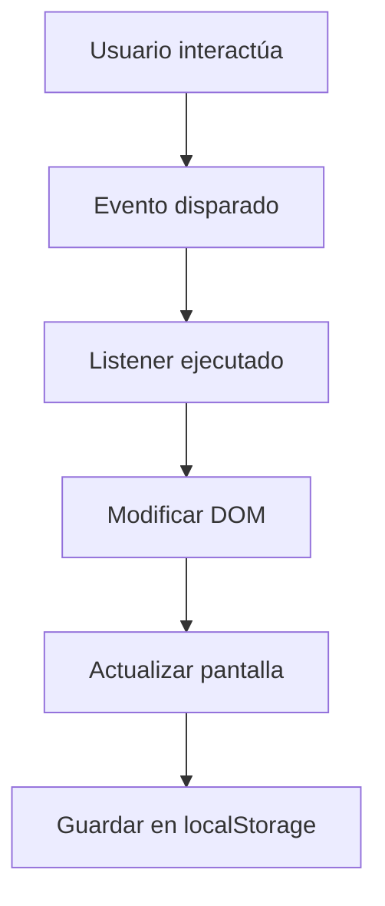
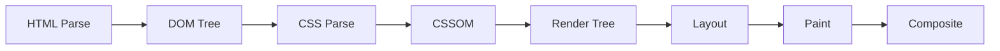

# 📱 Clase 02: JavaScript Moderno y Manipulación del DOM

**Duración:** 4 horas  
**Objetivo:** Dominar JavaScript ES6+, eventos y manipulación dinámica del DOM  
**Proyecto:** Funcionalidad interactiva para sistema de eventos

---

## 📚 Contenido

### 1. JavaScript ES6+ Moderno

```javascript
// Variables: const > let > var
const nombre = 'Juan';      // No reasignable
let edad = 25;              // Reasignable, scope local
var antiguo = 'evitar';     // Scope global, evitar

// Template literals
const mensaje = `Hola ${nombre}, tienes ${edad} años`;

// Destructuring
const evento = { id: 1, nombre: 'Concierto', precio: 50 };
const { id, nombre: nombreEvento } = evento;

const numeros = [1, 2, 3, 4, 5];
const [primero, segundo, ...resto] = numeros;

// Arrow functions
const sumar = (a, b) => a + b;
const saludar = () => console.log('Hola');
const procesar = items => items.map(item => item * 2);

// Spread operator
const arr1 = [1, 2, 3];
const arr2 = [...arr1, 4, 5];  // [1, 2, 3, 4, 5]

const obj1 = { a: 1, b: 2 };
const obj2 = { ...obj1, c: 3 }; // { a: 1, b: 2, c: 3 }

// Métodos de array
const eventos = [
    { id: 1, nombre: 'Concierto', precio: 50 },
    { id: 2, nombre: 'Teatro', precio: 30 },
    { id: 3, nombre: 'Cine', precio: 20 }
];

// map: transformar
const nombres = eventos.map(e => e.nombre);

// filter: filtrar
const baratos = eventos.filter(e => e.precio < 40);

// find: encontrar uno
const teatro = eventos.find(e => e.nombre === 'Teatro');

// reduce: acumular
const totalPrecio = eventos.reduce((sum, e) => sum + e.precio, 0);

// forEach: iterar
eventos.forEach(e => console.log(e.nombre));

// Clases
class Evento {
    constructor(id, nombre, precio) {
        this.id = id;
        this.nombre = nombre;
        this.precio = precio;
    }

    obtenerDescuento(porcentaje) {
        return this.precio * (1 - porcentaje / 100);
    }

    static crearEvento(datos) {
        return new Evento(datos.id, datos.nombre, datos.precio);
    }
}

const evento1 = new Evento(1, 'Concierto', 50);
console.log(evento1.obtenerDescuento(10)); // 45
```

### 2. Manipulación del DOM

```javascript
// Seleccionar elementos
const elemento = document.getElementById('busqueda');
const elementos = document.querySelectorAll('.evento-card');
const primero = document.querySelector('header');

// Crear elementos
const nuevoDiv = document.createElement('div');
nuevoDiv.className = 'evento-card';
nuevoDiv.innerHTML = `
    <h3>Nuevo Evento</h3>
    <p>Descripción</p>
`;

// Insertar en el DOM
const contenedor = document.querySelector('.grid');
contenedor.appendChild(nuevoDiv);
contenedor.insertBefore(nuevoDiv, contenedor.firstChild);

// Modificar atributos
nuevoDiv.setAttribute('data-id', '123');
nuevoDiv.id = 'evento-nuevo';
nuevoDiv.classList.add('destacado');
nuevoDiv.classList.remove('oculto');
nuevoDiv.classList.toggle('activo');

// Modificar estilos
nuevoDiv.style.backgroundColor = '#6366f1';
nuevoDiv.style.padding = '1rem';

// Acceder a propiedades
console.log(nuevoDiv.textContent);  // Texto sin HTML
console.log(nuevoDiv.innerHTML);    // Texto con HTML
console.log(nuevoDiv.offsetHeight); // Alto en píxeles

// Eliminar elementos
nuevoDiv.remove();
contenedor.removeChild(nuevoDiv);

// Clonar elementos
const clon = nuevoDiv.cloneNode(true); // true = con hijos
```

### 3. Eventos y Listeners

```javascript
// Agregar listeners
const boton = document.querySelector('button');

// Forma moderna: addEventListener
boton.addEventListener('click', (evento) => {
    console.log('Botón clickeado');
    console.log(evento.target);      // Elemento que disparó
    console.log(evento.type);        // Tipo de evento
    console.log(evento.preventDefault); // Prevenir default
});

// Eventos comunes
document.addEventListener('DOMContentLoaded', () => {
    console.log('DOM cargado');
});

window.addEventListener('resize', () => {
    console.log('Ventana redimensionada');
});

const input = document.querySelector('input');
input.addEventListener('input', (e) => {
    console.log('Valor:', e.target.value);
});

input.addEventListener('change', (e) => {
    console.log('Cambio finalizado:', e.target.value);
});

// Event delegation: escuchar en padre
const lista = document.querySelector('.grid');
lista.addEventListener('click', (e) => {
    if (e.target.tagName === 'BUTTON') {
        console.log('Botón clickeado:', e.target.textContent);
    }
});

// Prevenir comportamiento default
const formulario = document.querySelector('form');
formulario.addEventListener('submit', (e) => {
    e.preventDefault();
    console.log('Formulario enviado');
});

// Remover listeners
const manejador = () => console.log('Click');
boton.addEventListener('click', manejador);
boton.removeEventListener('click', manejador);
```

### 4. Validación de Formularios

```javascript
// Validar email
function validarEmail(email) {
    const regex = /^[^\s@]+@[^\s@]+\.[^\s@]+$/;
    return regex.test(email);
}

// Validar formulario
const formulario = document.querySelector('form');
formulario.addEventListener('submit', (e) => {
    e.preventDefault();

    const email = document.querySelector('#email').value;
    const password = document.querySelector('#password').value;

    // Validaciones
    if (!email) {
        mostrarError('Email requerido');
        return;
    }

    if (!validarEmail(email)) {
        mostrarError('Email inválido');
        return;
    }

    if (password.length < 8) {
        mostrarError('Contraseña debe tener al menos 8 caracteres');
        return;
    }

    // Si todo es válido
    console.log('Formulario válido');
    formulario.submit();
});

function mostrarError(mensaje) {
    const error = document.createElement('div');
    error.className = 'error-message';
    error.textContent = mensaje;
    formulario.insertBefore(error, formulario.firstChild);

    setTimeout(() => error.remove(), 3000);
}
```

### 5. Almacenamiento Local

```javascript
// localStorage: persiste entre sesiones
localStorage.setItem('usuario', JSON.stringify({ id: 1, nombre: 'Juan' }));
const usuario = JSON.parse(localStorage.getItem('usuario'));
localStorage.removeItem('usuario');
localStorage.clear();

// sessionStorage: solo durante la sesión
sessionStorage.setItem('token', 'abc123');
const token = sessionStorage.getItem('token');

// Ejemplo: guardar preferencias
function guardarPreferencias() {
    const preferencias = {
        idioma: 'es',
        tema: 'oscuro',
        notificaciones: true
    };
    localStorage.setItem('preferencias', JSON.stringify(preferencias));
}

function cargarPreferencias() {
    const prefs = JSON.parse(localStorage.getItem('preferencias')) || {};
    return prefs;
}
```

---

## 🎯 Ejercicio Práctico

### Objetivo
Crear funcionalidad interactiva para buscar, filtrar y agregar eventos a favoritos.

### Paso 1: HTML con estructura

```html
<!-- index.html -->
<main>
    <section class="filtros">
        <input 
            id="busqueda" 
            type="search" 
            placeholder="Buscar eventos..."
            aria-label="Buscar eventos"
        >
        <select id="categoria" aria-label="Filtrar por categoría">
            <option value="">Todas</option>
            <option value="musica">Música</option>
            <option value="deportes">Deportes</option>
            <option value="cultura">Cultura</option>
        </select>
    </section>

    <div id="eventos" class="grid"></div>
    <div id="favoritos" class="favoritos-panel">
        <h3>Mis Favoritos</h3>
        <ul id="lista-favoritos"></ul>
    </div>
</main>
```

### Paso 2: JavaScript - Lógica

```javascript
// datos.js
const eventosData = [
    { id: 1, nombre: 'Concierto Rock', categoria: 'musica', precio: 50, fecha: '2024-12-25' },
    { id: 2, nombre: 'Partido Fútbol', categoria: 'deportes', precio: 30, fecha: '2024-12-26' },
    { id: 3, nombre: 'Exposición Arte', categoria: 'cultura', precio: 20, fecha: '2024-12-27' },
    { id: 4, nombre: 'Concierto Jazz', categoria: 'musica', precio: 40, fecha: '2024-12-28' },
    { id: 5, nombre: 'Carrera 10K', categoria: 'deportes', precio: 15, fecha: '2024-12-29' }
];

// app.js
class GestorEventos {
    constructor() {
        this.eventos = eventosData;
        this.favoritos = this.cargarFavoritos();
        this.eventosFiltrados = this.eventos;
        this.init();
    }

    init() {
        this.renderizarEventos();
        this.agregarListeners();
    }

    agregarListeners() {
        const busqueda = document.querySelector('#busqueda');
        const categoria = document.querySelector('#categoria');

        busqueda.addEventListener('input', (e) => {
            this.filtrar(e.target.value, categoria.value);
        });

        categoria.addEventListener('change', (e) => {
            this.filtrar(busqueda.value, e.target.value);
        });
    }

    filtrar(texto, cat) {
        this.eventosFiltrados = this.eventos.filter(evento => {
            const coincideTexto = evento.nombre.toLowerCase().includes(texto.toLowerCase());
            const coincideCategoria = !cat || evento.categoria === cat;
            return coincideTexto && coincideCategoria;
        });

        this.renderizarEventos();
    }

    renderizarEventos() {
        const contenedor = document.querySelector('#eventos');
        contenedor.innerHTML = '';

        this.eventosFiltrados.forEach(evento => {
            const card = this.crearCard(evento);
            contenedor.appendChild(card);
        });
    }

    crearCard(evento) {
        const card = document.createElement('article');
        card.className = 'evento-card';
        card.innerHTML = `
            <h3>${evento.nombre}</h3>
            <p class="categoria">${evento.categoria}</p>
            <p class="fecha">${evento.fecha}</p>
            <p class="precio">$${evento.precio}</p>
            <div class="acciones">
                <button class="btn-favorito" data-id="${evento.id}">
                    ${this.esFavorito(evento.id) ? '❤️' : '🤍'} Favorito
                </button>
                <button class="btn-comprar" data-id="${evento.id}">
                    Comprar
                </button>
            </div>
        `;

        // Event delegation
        card.querySelector('.btn-favorito').addEventListener('click', () => {
            this.toggleFavorito(evento);
        });

        card.querySelector('.btn-comprar').addEventListener('click', () => {
            this.comprar(evento);
        });

        return card;
    }

    toggleFavorito(evento) {
        const index = this.favoritos.findIndex(f => f.id === evento.id);
        
        if (index > -1) {
            this.favoritos.splice(index, 1);
        } else {
            this.favoritos.push(evento);
        }

        this.guardarFavoritos();
        this.renderizarEventos();
        this.renderizarFavoritos();
    }

    esFavorito(id) {
        return this.favoritos.some(f => f.id === id);
    }

    renderizarFavoritos() {
        const lista = document.querySelector('#lista-favoritos');
        lista.innerHTML = '';

        this.favoritos.forEach(evento => {
            const item = document.createElement('li');
            item.innerHTML = `
                <span>${evento.nombre}</span>
                <button class="btn-eliminar" data-id="${evento.id}">✕</button>
            `;
            item.querySelector('.btn-eliminar').addEventListener('click', () => {
                this.toggleFavorito(evento);
            });
            lista.appendChild(item);
        });
    }

    guardarFavoritos() {
        localStorage.setItem('favoritos', JSON.stringify(this.favoritos));
    }

    cargarFavoritos() {
        const guardados = localStorage.getItem('favoritos');
        return guardados ? JSON.parse(guardados) : [];
    }

    comprar(evento) {
        alert(`Comprando entrada para: ${evento.nombre}`);
        // Aquí iría la lógica de compra
    }
}

// Inicializar cuando el DOM esté listo
document.addEventListener('DOMContentLoaded', () => {
    new GestorEventos();
});
```

### Paso 3: Estilos

```css
/* styles.css */
.filtros {
    display: flex;
    gap: 1rem;
    margin-bottom: 2rem;
    flex-wrap: wrap;
}

.filtros input,
.filtros select {
    padding: 0.75rem;
    border: 2px solid #e5e7eb;
    border-radius: 4px;
    font-size: 1rem;
}

.filtros input:focus,
.filtros select:focus {
    outline: none;
    border-color: #6366f1;
    box-shadow: 0 0 0 3px rgba(99, 102, 241, 0.1);
}

.evento-card {
    border: 1px solid #e5e7eb;
    border-radius: 8px;
    padding: 1.5rem;
    transition: all 0.3s;
}

.evento-card:hover {
    box-shadow: 0 10px 25px rgba(0, 0, 0, 0.1);
    transform: translateY(-4px);
}

.evento-card h3 {
    margin-bottom: 0.5rem;
    color: #1f2937;
}

.categoria {
    display: inline-block;
    background: #e0e7ff;
    color: #6366f1;
    padding: 0.25rem 0.75rem;
    border-radius: 20px;
    font-size: 0.875rem;
    margin-bottom: 0.5rem;
}

.precio {
    font-size: 1.5rem;
    font-weight: bold;
    color: #6366f1;
    margin: 1rem 0;
}

.acciones {
    display: flex;
    gap: 0.5rem;
    margin-top: 1rem;
}

.acciones button {
    flex: 1;
    padding: 0.75rem;
    border: none;
    border-radius: 4px;
    cursor: pointer;
    font-weight: 600;
    transition: all 0.3s;
}

.btn-favorito {
    background: white;
    border: 2px solid #6366f1;
    color: #6366f1;
}

.btn-favorito:hover {
    background: #f0f4ff;
}

.btn-comprar {
    background: #6366f1;
    color: white;
}

.btn-comprar:hover {
    background: #4f46e5;
}

.favoritos-panel {
    position: sticky;
    top: 100px;
    background: #f9fafb;
    padding: 1.5rem;
    border-radius: 8px;
    border: 1px solid #e5e7eb;
}

#lista-favoritos {
    list-style: none;
    margin-top: 1rem;
}

#lista-favoritos li {
    display: flex;
    justify-content: space-between;
    align-items: center;
    padding: 0.75rem;
    background: white;
    border-radius: 4px;
    margin-bottom: 0.5rem;
}

.btn-eliminar {
    background: #ef4444;
    color: white;
    border: none;
    border-radius: 4px;
    padding: 0.25rem 0.5rem;
    cursor: pointer;
}

@media (max-width: 768px) {
    .filtros {
        flex-direction: column;
    }

    .acciones {
        flex-direction: column;
    }
}
```

---

## 📊 Diagramas

### Flujo de Eventos



### Ciclo de Vida del DOM



---

## 📝 Resumen

- ✅ JavaScript ES6+ moderno
- ✅ Manipulación dinámica del DOM
- ✅ Eventos y listeners
- ✅ Validación de formularios
- ✅ localStorage para persistencia
- ✅ Event delegation

---

## 🎓 Preguntas de Repaso

**P1:** ¿Cuál es la diferencia entre `const` y `let`?  
**R1:** `const` no se puede reasignar, `let` sí. Ambos tienen scope local.

**P2:** ¿Qué es event delegation?  
**R2:** Escuchar eventos en un elemento padre en lugar de en cada hijo.

**P3:** ¿Cómo validar un email en JavaScript?  
**R3:** Usar expresiones regulares o la API de validación HTML5.

**P4:** ¿Cuándo usar localStorage vs sessionStorage?  
**R4:** localStorage persiste entre sesiones, sessionStorage solo durante la sesión actual.

**P5:** ¿Qué es destructuring?  
**R5:** Extraer valores de objetos o arrays en variables separadas.

---

## 🚀 Próxima Clase

**Clase 03: Bootstrap y Material Design - Responsive**

Crear interfaces profesionales con Bootstrap 5 y Material Design.

---

**Última actualización:** 2024  
**Tiempo estimado:** 4 horas  
**Complejidad:** ⭐⭐ (Intermedio)
