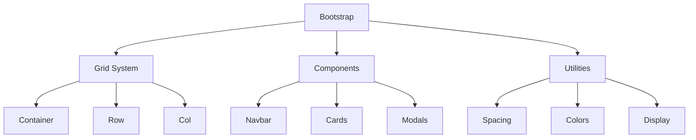

# 📱 Clase 03: Bootstrap y Material Design - Responsive

**Duración:** 4 horas  
**Objetivo:** Crear interfaces profesionales con Bootstrap 5 y Material Design  
**Proyecto:** Interfaz completa para sistema de eventos

---

## 📚 Contenido

### 1. Bootstrap 5 - Fundamentos

Bootstrap es un framework CSS que proporciona componentes y utilidades responsive.

```html
<!DOCTYPE html>
<html lang="es">
<head>
    <meta charset="UTF-8">
    <meta name="viewport" content="width=device-width, initial-scale=1.0">
    <title>TuFiesta - Bootstrap</title>
    <!-- Bootstrap CSS -->
    <link href="https://cdn.jsdelivr.net/npm/bootstrap@5.3.0/dist/css/bootstrap.min.css" rel="stylesheet">
</head>
<body>
    <!-- Navbar -->
    <nav class="navbar navbar-expand-lg navbar-dark bg-primary">
        <div class="container-fluid">
            <a class="navbar-brand" href="#">TuFiesta</a>
            <button class="navbar-toggler" type="button" data-bs-toggle="collapse" data-bs-target="#navbarNav">
                <span class="navbar-toggler-icon"></span>
            </button>
            <div class="collapse navbar-collapse" id="navbarNav">
                <ul class="navbar-nav ms-auto">
                    <li class="nav-item">
                        <a class="nav-link active" href="#">Inicio</a>
                    </li>
                    <li class="nav-item">
                        <a class="nav-link" href="#">Eventos</a>
                    </li>
                    <li class="nav-item">
                        <a class="nav-link" href="#">Contacto</a>
                    </li>
                </ul>
            </div>
        </div>
    </nav>

    <!-- Hero Section -->
    <section class="hero bg-gradient py-5">
        <div class="container">
            <div class="row align-items-center">
                <div class="col-lg-6">
                    <h1 class="display-4 fw-bold mb-4">Descubre Eventos Increíbles</h1>
                    <p class="lead mb-4">Encuentra y compra entradas para tus eventos favoritos</p>
                    <button class="btn btn-primary btn-lg">Explorar Eventos</button>
                </div>
                <div class="col-lg-6">
                    
                </div>
            </div>
        </div>
    </section>

    <!-- Grid de Eventos -->
    <section class="py-5">
        <div class="container">
            <h2 class="mb-4">Eventos Destacados</h2>
            <div class="row g-4">
                <!-- Card 1 -->
                <div class="col-md-6 col-lg-4">
                    <div class="card h-100 shadow-sm">
                        
                        <div class="card-body">
                            <h5 class="card-title">Concierto Rock</h5>
                            <p class="card-text">25 de Diciembre - Estadio Centenario</p>
                            <p class="text-primary fw-bold">$50</p>
                        </div>
                        <div class="card-footer bg-white">
                            <button class="btn btn-primary w-100">Comprar Entrada</button>
                        </div>
                    </div>
                </div>
                <!-- Más cards -->
            </div>
        </div>
    </section>

    <!-- Bootstrap JS -->
    <script src="https://cdn.jsdelivr.net/npm/bootstrap@5.3.0/dist/js/bootstrap.bundle.min.js"></script>
</body>
</html>
```

**Clases Bootstrap principales:**

```html
<!-- Espaciado: margin y padding -->
<div class="m-3">Margen 3</div>
<div class="p-4">Padding 4</div>
<div class="mx-auto">Margen horizontal auto</div>
<div class="py-5">Padding vertical 5</div>

<!-- Flexbox -->
<div class="d-flex justify-content-between align-items-center">
    <span>Izquierda</span>
    <span>Derecha</span>
</div>

<!-- Grid -->
<div class="row">
    <div class="col-md-6">50% en md</div>
    <div class="col-md-6">50% en md</div>
</div>

<!-- Colores -->
<div class="bg-primary text-white">Fondo primario</div>
<div class="text-danger">Texto rojo</div>
<div class="border border-success">Borde verde</div>

<!-- Tipografía -->
<h1 class="display-1">Display 1</h1>
<p class="lead">Párrafo destacado</p>
<small class="text-muted">Texto pequeño</small>

<!-- Botones -->
<button class="btn btn-primary">Primario</button>
<button class="btn btn-outline-secondary">Outline</button>
<button class="btn btn-sm">Pequeño</button>
<button class="btn btn-lg">Grande</button>

<!-- Formularios -->
<div class="mb-3">
    <label for="email" class="form-label">Email</label>
    <input type="email" class="form-control" id="email">
</div>

<!-- Alertas -->
<div class="alert alert-success" role="alert">
    ¡Éxito! Tu entrada fue comprada.
</div>

<!-- Modales -->
<div class="modal fade" id="modalCompra" tabindex="-1">
    <div class="modal-dialog">
        <div class="modal-content">
            <div class="modal-header">
                <h5 class="modal-title">Comprar Entrada</h5>
                <button type="button" class="btn-close" data-bs-dismiss="modal"></button>
            </div>
            <div class="modal-body">
                Contenido del modal
            </div>
            <div class="modal-footer">
                <button type="button" class="btn btn-secondary" data-bs-dismiss="modal">Cancelar</button>
                <button type="button" class="btn btn-primary">Comprar</button>
            </div>
        </div>
    </div>
</div>
```

### 2. Material Design con Material-UI

Material Design es un sistema de diseño de Google que enfatiza la claridad y la usabilidad.

```html
<!-- Material Icons -->
<link href="https://fonts.googleapis.com/icon?family=Material+Icons" rel="stylesheet">

<!-- Usar iconos -->
<i class="material-icons">favorite</i>
<i class="material-icons">shopping_cart</i>
<i class="material-icons">search</i>

<!-- Componentes Material -->
<style>
    /* Material Design Colors */
    :root {
        --md-primary: #6200ee;
        --md-secondary: #03dac6;
        --md-error: #cf6679;
        --md-surface: #ffffff;
        --md-on-surface: #212121;
    }

    /* Material Buttons */
    .md-button {
        padding: 0.75rem 1.5rem;
        border: none;
        border-radius: 4px;
        font-weight: 500;
        cursor: pointer;
        transition: all 0.3s;
        text-transform: uppercase;
        font-size: 0.875rem;
        letter-spacing: 0.5px;
    }

    .md-button-contained {
        background: var(--md-primary);
        color: white;
        box-shadow: 0 3px 1px -2px rgba(0, 0, 0, 0.2);
    }

    .md-button-contained:hover {
        background: #5200d9;
        box-shadow: 0 5px 5px -3px rgba(0, 0, 0, 0.2);
    }

    .md-button-outlined {
        background: transparent;
        color: var(--md-primary);
        border: 2px solid var(--md-primary);
    }

    .md-button-outlined:hover {
        background: rgba(98, 0, 238, 0.08);
    }

    /* Material Cards */
    .md-card {
        background: var(--md-surface);
        border-radius: 4px;
        box-shadow: 0 2px 1px -1px rgba(0, 0, 0, 0.2);
        overflow: hidden;
        transition: all 0.3s;
    }

    .md-card:hover {
        box-shadow: 0 8px 10px -5px rgba(0, 0, 0, 0.2);
    }

    .md-card-header {
        padding: 1.5rem;
        border-bottom: 1px solid #e0e0e0;
    }

    .md-card-content {
        padding: 1.5rem;
    }

    .md-card-actions {
        padding: 0.5rem;
        display: flex;
        gap: 0.5rem;
    }

    /* Material Text Fields */
    .md-text-field {
        position: relative;
        margin-bottom: 1.5rem;
    }

    .md-text-field input {
        width: 100%;
        padding: 0.75rem 0;
        border: none;
        border-bottom: 2px solid #e0e0e0;
        font-size: 1rem;
        transition: border-color 0.3s;
    }

    .md-text-field input:focus {
        outline: none;
        border-bottom-color: var(--md-primary);
    }

    .md-text-field label {
        position: absolute;
        top: 0.75rem;
        left: 0;
        color: #999;
        transition: all 0.3s;
        pointer-events: none;
    }

    .md-text-field input:focus ~ label,
    .md-text-field input:not(:placeholder-shown) ~ label {
        top: -1rem;
        font-size: 0.75rem;
        color: var(--md-primary);
    }

    /* Material Elevation */
    .elevation-1 { box-shadow: 0 2px 1px -1px rgba(0, 0, 0, 0.2); }
    .elevation-2 { box-shadow: 0 3px 1px -2px rgba(0, 0, 0, 0.2); }
    .elevation-4 { box-shadow: 0 5px 5px -3px rgba(0, 0, 0, 0.2); }
    .elevation-8 { box-shadow: 0 8px 10px -5px rgba(0, 0, 0, 0.2); }
</style>
```

### 3. Responsive Design

```html
<!-- Breakpoints de Bootstrap -->
<!-- xs: < 576px -->
<!-- sm: >= 576px -->
<!-- md: >= 768px -->
<!-- lg: >= 992px -->
<!-- xl: >= 1200px -->
<!-- xxl: >= 1400px -->

<!-- Ejemplo responsive -->
<div class="container">
    <div class="row">
        <!-- En móvil: 100%, en tablet: 50%, en desktop: 33% -->
        <div class="col-12 col-md-6 col-lg-4">
            <div class="card">
                
                <div class="card-body">
                    <h5 class="card-title">Evento</h5>
                    <p class="card-text">Descripción</p>
                </div>
            </div>
        </div>
    </div>
</div>

<!-- Ocultar/Mostrar según pantalla -->
<div class="d-none d-md-block">Visible solo en md+</div>
<div class="d-md-none">Visible solo en xs-sm</div>

<!-- Imágenes responsive -->


<!-- Tabla responsive -->
<div class="table-responsive">
    <table class="table">
        <thead>
            <tr>
                <th>Evento</th>
                <th>Fecha</th>
                <th>Precio</th>
            </tr>
        </thead>
        <tbody>
            <tr>
                <td>Concierto</td>
                <td>25/12</td>
                <td>$50</td>
            </tr>
        </tbody>
    </table>
</div>
```

---

## 🎯 Ejercicio Práctico

### Objetivo
Crear interfaz completa con Bootstrap y Material Design para sistema de eventos.

### Paso 1: HTML con Bootstrap

```html
<!DOCTYPE html>
<html lang="es">
<head>
    <meta charset="UTF-8">
    <meta name="viewport" content="width=device-width, initial-scale=1.0">
    <title>TuFiesta - Eventos</title>
    <link href="https://cdn.jsdelivr.net/npm/bootstrap@5.3.0/dist/css/bootstrap.min.css" rel="stylesheet">
    <link href="https://fonts.googleapis.com/icon?family=Material+Icons" rel="stylesheet">
    <link rel="stylesheet" href="styles.css">
</head>
<body>
    <!-- Navbar -->
    <nav class="navbar navbar-expand-lg navbar-dark bg-primary sticky-top">
        <div class="container-fluid">
            <a class="navbar-brand fw-bold" href="#">
                <i class="material-icons align-middle">event</i> TuFiesta
            </a>
            <button class="navbar-toggler" type="button" data-bs-toggle="collapse" data-bs-target="#navbarNav">
                <span class="navbar-toggler-icon"></span>
            </button>
            <div class="collapse navbar-collapse" id="navbarNav">
                <ul class="navbar-nav ms-auto">
                    <li class="nav-item">
                        <a class="nav-link" href="#eventos">Eventos</a>
                    </li>
                    <li class="nav-item">
                        <a class="nav-link" href="#favoritos">Favoritos</a>
                    </li>
                    <li class="nav-item">
                        <a class="nav-link" href="#perfil">Perfil</a>
                    </li>
                </ul>
            </div>
        </div>
    </nav>

    <!-- Hero -->
    <section class="hero bg-gradient py-5 text-white">
        <div class="container">
            <div class="row align-items-center">
                <div class="col-lg-6">
                    <h1 class="display-4 fw-bold mb-4">Descubre Eventos Increíbles</h1>
                    <p class="lead mb-4">Encuentra y compra entradas para tus eventos favoritos</p>
                    <div class="input-group input-group-lg">
                        <input type="text" class="form-control" placeholder="Buscar eventos...">
                        <button class="btn btn-light" type="button">
                            <i class="material-icons">search</i>
                        </button>
                    </div>
                </div>
            </div>
        </div>
    </section>

    <!-- Filtros -->
    <section class="py-4 bg-light">
        <div class="container">
            <div class="row g-3">
                <div class="col-md-4">
                    <select class="form-select" id="categoria">
                        <option value="">Todas las categorías</option>
                        <option value="musica">Música</option>
                        <option value="deportes">Deportes</option>
                        <option value="cultura">Cultura</option>
                    </select>
                </div>
                <div class="col-md-4">
                    <input type="date" class="form-control" id="fecha">
                </div>
                <div class="col-md-4">
                    <select class="form-select" id="precio">
                        <option value="">Todos los precios</option>
                        <option value="0-30">$0 - $30</option>
                        <option value="30-60">$30 - $60</option>
                        <option value="60+">$60+</option>
                    </select>
                </div>
            </div>
        </div>
    </section>

    <!-- Eventos Grid -->
    <section class="py-5" id="eventos">
        <div class="container">
            <h2 class="mb-4">Eventos Disponibles</h2>
            <div class="row g-4" id="eventos-grid">
                <!-- Eventos se cargan aquí con JavaScript -->
            </div>
        </div>
    </section>

    <!-- Modal de Compra -->
    <div class="modal fade" id="modalCompra" tabindex="-1">
        <div class="modal-dialog">
            <div class="modal-content">
                <div class="modal-header">
                    <h5 class="modal-title">Comprar Entrada</h5>
                    <button type="button" class="btn-close" data-bs-dismiss="modal"></button>
                </div>
                <div class="modal-body">
                    <div class="mb-3">
                        <label class="form-label">Cantidad</label>
                        <input type="number" class="form-control" min="1" value="1">
                    </div>
                    <div class="mb-3">
                        <label class="form-label">Método de Pago</label>
                        <select class="form-select">
                            <option>Tarjeta de Crédito</option>
                            <option>Transferencia</option>
                            <option>Billetera Digital</option>
                        </select>
                    </div>
                </div>
                <div class="modal-footer">
                    <button type="button" class="btn btn-secondary" data-bs-dismiss="modal">Cancelar</button>
                    <button type="button" class="btn btn-primary">Comprar</button>
                </div>
            </div>
        </div>
    </div>

    <!-- Footer -->
    <footer class="bg-dark text-white py-4 mt-5">
        <div class="container">
            <div class="row">
                <div class="col-md-4">
                    <h5>TuFiesta</h5>
                    <p>Plataforma de eventos online</p>
                </div>
                <div class="col-md-4">
                    <h5>Enlaces</h5>
                    <ul class="list-unstyled">
                        <li><a href="#" class="text-white-50">Sobre nosotros</a></li>
                        <li><a href="#" class="text-white-50">Contacto</a></li>
                        <li><a href="#" class="text-white-50">Términos</a></li>
                    </ul>
                </div>
                <div class="col-md-4">
                    <h5>Síguenos</h5>
                    <div class="d-flex gap-2">
                        <a href="#" class="text-white-50"><i class="material-icons">facebook</i></a>
                        <a href="#" class="text-white-50"><i class="material-icons">twitter</i></a>
                        <a href="#" class="text-white-50"><i class="material-icons">instagram</i></a>
                    </div>
                </div>
            </div>
        </div>
    </footer>

    <script src="https://cdn.jsdelivr.net/npm/bootstrap@5.3.0/dist/js/bootstrap.bundle.min.js"></script>
    <script src="app.js"></script>
</body>
</html>
```

### Paso 2: JavaScript para renderizar eventos

```javascript
// app.js
const eventos = [
    { id: 1, nombre: 'Concierto Rock', categoria: 'musica', precio: 50, fecha: '2024-12-25', imagen: 'rock.jpg' },
    { id: 2, nombre: 'Partido Fútbol', categoria: 'deportes', precio: 30, fecha: '2024-12-26', imagen: 'futbol.jpg' },
    { id: 3, nombre: 'Exposición Arte', categoria: 'cultura', precio: 20, fecha: '2024-12-27', imagen: 'arte.jpg' }
];

function renderizarEventos(eventosFiltrados = eventos) {
    const grid = document.querySelector('#eventos-grid');
    grid.innerHTML = '';

    eventosFiltrados.forEach(evento => {
        const card = document.createElement('div');
        card.className = 'col-md-6 col-lg-4';
        card.innerHTML = `
            <div class="card h-100 shadow-sm">
                
                <div class="card-body">
                    <h5 class="card-title">${evento.nombre}</h5>
                    <p class="card-text text-muted">${evento.fecha}</p>
                    <p class="card-text">
                        <span class="badge bg-primary">${evento.categoria}</span>
                    </p>
                    <p class="h5 text-primary">$${evento.precio}</p>
                </div>
                <div class="card-footer bg-white">
                    <button class="btn btn-primary w-100" data-bs-toggle="modal" data-bs-target="#modalCompra">
                        <i class="material-icons align-middle">shopping_cart</i> Comprar
                    </button>
                </div>
            </div>
        `;
        grid.appendChild(card);
    });
}

// Filtros
document.querySelector('#categoria').addEventListener('change', (e) => {
    const filtrados = eventos.filter(ev => !e.target.value || ev.categoria === e.target.value);
    renderizarEventos(filtrados);
});

// Inicializar
document.addEventListener('DOMContentLoaded', () => {
    renderizarEventos();
});
```

### Paso 3: Estilos personalizados

```css
/* styles.css */
:root {
    --primary: #6366f1;
    --secondary: #ec4899;
}

.hero {
    background: linear-gradient(135deg, var(--primary), var(--secondary));
}

.card {
    border: none;
    transition: all 0.3s;
}

.card:hover {
    transform: translateY(-8px);
    box-shadow: 0 12px 24px rgba(0, 0, 0, 0.15) !important;
}

.btn-primary {
    background: var(--primary);
    border: none;
}

.btn-primary:hover {
    background: #4f46e5;
}

@media (max-width: 768px) {
    .hero h1 {
        font-size: 1.75rem;
    }
}
```

---

## 📊 Diagramas

### Estructura Bootstrap



---

## 📝 Resumen

- ✅ Bootstrap 5 para layout responsive
- ✅ Material Design para componentes
- ✅ Grid system flexible
- ✅ Componentes reutilizables
- ✅ Mobile first
- ✅ Accesibilidad integrada

---

## 🎓 Preguntas de Repaso

**P1:** ¿Cuál es la diferencia entre Bootstrap y Material Design?  
**R1:** Bootstrap es un framework CSS completo, Material Design es un sistema de diseño de Google.

**P2:** ¿Cómo hacer una grid responsive en Bootstrap?  
**R2:** Usar `col-12 col-md-6 col-lg-4` para diferentes breakpoints.

**P3:** ¿Qué es un modal en Bootstrap?  
**R3:** Un diálogo que aparece encima del contenido principal.

**P4:** ¿Cómo ocultar elementos en móvil?  
**R4:** Usar `d-none d-md-block` para mostrar solo en md+.

**P5:** ¿Qué es elevation en Material Design?  
**R5:** La profundidad visual creada con sombras.

---

## 🚀 Próxima Clase

**Clase 04: Node.js, Express y Primeras APIs REST**

Crear servidor backend con Node.js y Express.

---

**Última actualización:** 2024  
**Tiempo estimado:** 4 horas  
**Complejidad:** ⭐⭐ (Intermedio)
