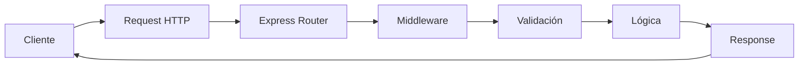
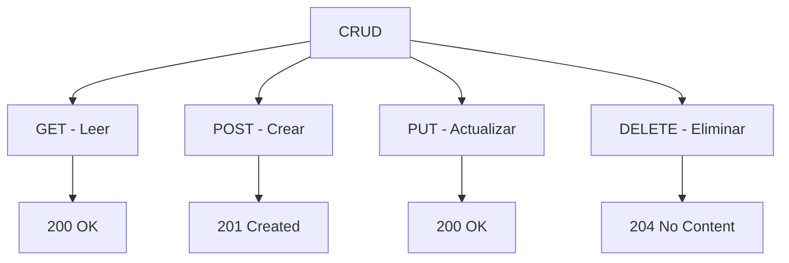

# 📱 Clase 04: Node.js, Express y Primeras APIs REST

**Duración:** 4 horas  
**Objetivo:** Crear servidor backend con Node.js y Express, implementar APIs REST  
**Proyecto:** API REST para sistema de eventos

---

## 📚 Contenido

### 1. Fundamentos de Node.js

Node.js es un runtime de JavaScript que permite ejecutar código en el servidor.

```bash
# Instalar Node.js 18+
# Descargar desde https://nodejs.org/

# Verificar instalación
node --version
npm --version

# Crear proyecto
mkdir mi-api
cd mi-api
npm init -y

# Instalar dependencias
npm install express cors dotenv joi
npm install --save-dev nodemon
```

**package.json:**

```json
{
  "name": "tufiesta-api",
  "version": "1.0.0",
  "description": "API REST para sistema de eventos",
  "main": "index.js",
  "scripts": {
    "start": "node index.js",
    "dev": "nodemon index.js"
  },
  "dependencies": {
    "express": "^4.18.2",
    "cors": "^2.8.5",
    "dotenv": "^16.3.1",
    "joi": "^17.11.0"
  },
  "devDependencies": {
    "nodemon": "^3.0.1"
  }
}
```

### 2. Crear servidor Express

```javascript
// index.js
const express = require('express');
const cors = require('cors');
require('dotenv').config();

const app = express();
const PORT = process.env.PORT || 3000;

// Middleware
app.use(cors());
app.use(express.json());

// Rutas
app.get('/', (req, res) => {
    res.json({ mensaje: 'Bienvenido a TuFiesta API' });
});

// Iniciar servidor
app.listen(PORT, () => {
    console.log(`Servidor ejecutándose en http://localhost:${PORT}`);
});
```

**Ejecutar:**

```bash
npm run dev
# Servidor ejecutándose en http://localhost:3000
```

### 3. APIs REST - Métodos HTTP

```javascript
// Datos en memoria (después usaremos BD)
let eventos = [
    { id: 1, nombre: 'Concierto Rock', precio: 50, fecha: '2024-12-25' },
    { id: 2, nombre: 'Partido Fútbol', precio: 30, fecha: '2024-12-26' }
];

// GET - Obtener todos
app.get('/api/eventos', (req, res) => {
    res.json(eventos);
});

// GET - Obtener por ID
app.get('/api/eventos/:id', (req, res) => {
    const evento = eventos.find(e => e.id === parseInt(req.params.id));
    if (!evento) {
        return res.status(404).json({ error: 'Evento no encontrado' });
    }
    res.json(evento);
});

// POST - Crear
app.post('/api/eventos', (req, res) => {
    const { nombre, precio, fecha } = req.body;

    // Validación básica
    if (!nombre || !precio || !fecha) {
        return res.status(400).json({ error: 'Faltan campos requeridos' });
    }

    const nuevoEvento = {
        id: eventos.length > 0 ? Math.max(...eventos.map(e => e.id)) + 1 : 1,
        nombre,
        precio,
        fecha
    };

    eventos.push(nuevoEvento);
    res.status(201).json(nuevoEvento);
});

// PUT - Actualizar
app.put('/api/eventos/:id', (req, res) => {
    const evento = eventos.find(e => e.id === parseInt(req.params.id));
    if (!evento) {
        return res.status(404).json({ error: 'Evento no encontrado' });
    }

    const { nombre, precio, fecha } = req.body;
    if (nombre) evento.nombre = nombre;
    if (precio) evento.precio = precio;
    if (fecha) evento.fecha = fecha;

    res.json(evento);
});

// DELETE - Eliminar
app.delete('/api/eventos/:id', (req, res) => {
    const index = eventos.findIndex(e => e.id === parseInt(req.params.id));
    if (index === -1) {
        return res.status(404).json({ error: 'Evento no encontrado' });
    }

    const eventoEliminado = eventos.splice(index, 1);
    res.json(eventoEliminado[0]);
});
```

### 4. Validación con Joi

```javascript
const Joi = require('joi');

// Esquema de validación
const esquemaEvento = Joi.object({
    nombre: Joi.string().min(3).max(100).required(),
    precio: Joi.number().positive().required(),
    fecha: Joi.date().iso().required(),
    descripcion: Joi.string().max(500)
});

// Middleware de validación
const validarEvento = (req, res, next) => {
    const { error, value } = esquemaEvento.validate(req.body);
    if (error) {
        return res.status(400).json({ error: error.details[0].message });
    }
    req.body = value;
    next();
};

// Usar en rutas
app.post('/api/eventos', validarEvento, (req, res) => {
    const nuevoEvento = {
        id: eventos.length > 0 ? Math.max(...eventos.map(e => e.id)) + 1 : 1,
        ...req.body
    };
    eventos.push(nuevoEvento);
    res.status(201).json(nuevoEvento);
});

app.put('/api/eventos/:id', validarEvento, (req, res) => {
    const evento = eventos.find(e => e.id === parseInt(req.params.id));
    if (!evento) {
        return res.status(404).json({ error: 'Evento no encontrado' });
    }
    Object.assign(evento, req.body);
    res.json(evento);
});
```

### 5. Manejo de Errores

```javascript
// Middleware de error global
app.use((err, req, res, next) => {
    console.error(err.stack);
    res.status(500).json({ error: 'Error interno del servidor' });
});

// Ruta no encontrada
app.use((req, res) => {
    res.status(404).json({ error: 'Ruta no encontrada' });
});

// Ejemplo de try-catch
app.get('/api/eventos/:id', (req, res) => {
    try {
        const evento = eventos.find(e => e.id === parseInt(req.params.id));
        if (!evento) {
            return res.status(404).json({ error: 'Evento no encontrado' });
        }
        res.json(evento);
    } catch (error) {
        res.status(500).json({ error: error.message });
    }
});
```

### 6. Variables de Entorno

```bash
# .env
PORT=3000
NODE_ENV=development
API_URL=http://localhost:3000
```

```javascript
// Usar en código
const PORT = process.env.PORT || 3000;
const NODE_ENV = process.env.NODE_ENV || 'development';

console.log(`Ambiente: ${NODE_ENV}`);
```

---

## 🎯 Ejercicio Práctico

### Objetivo
Crear API REST completa para gestionar eventos con validación.

### Paso 1: Estructura del proyecto

```bash
mkdir tufiesta-api
cd tufiesta-api
npm init -y
npm install express cors dotenv joi
npm install --save-dev nodemon
```

### Paso 2: Crear servidor base

```javascript
// index.js
const express = require('express');
const cors = require('cors');
require('dotenv').config();

const app = express();
const PORT = process.env.PORT || 3000;

// Middleware
app.use(cors());
app.use(express.json());

// Datos
let eventos = [];
let idCounter = 1;

// GET - Listar eventos
app.get('/api/eventos', (req, res) => {
    const { categoria, precioMin, precioMax } = req.query;

    let filtrados = eventos;

    if (categoria) {
        filtrados = filtrados.filter(e => e.categoria === categoria);
    }

    if (precioMin) {
        filtrados = filtrados.filter(e => e.precio >= parseFloat(precioMin));
    }

    if (precioMax) {
        filtrados = filtrados.filter(e => e.precio <= parseFloat(precioMax));
    }

    res.json(filtrados);
});

// GET - Obtener por ID
app.get('/api/eventos/:id', (req, res) => {
    const evento = eventos.find(e => e.id === parseInt(req.params.id));
    if (!evento) {
        return res.status(404).json({ error: 'Evento no encontrado' });
    }
    res.json(evento);
});

// POST - Crear evento
app.post('/api/eventos', (req, res) => {
    const { nombre, categoria, precio, fecha, descripcion } = req.body;

    // Validación
    if (!nombre || !categoria || !precio || !fecha) {
        return res.status(400).json({ error: 'Faltan campos requeridos' });
    }

    if (precio <= 0) {
        return res.status(400).json({ error: 'El precio debe ser positivo' });
    }

    const nuevoEvento = {
        id: idCounter++,
        nombre,
        categoria,
        precio,
        fecha,
        descripcion: descripcion || '',
        createdAt: new Date()
    };

    eventos.push(nuevoEvento);
    res.status(201).json(nuevoEvento);
});

// PUT - Actualizar evento
app.put('/api/eventos/:id', (req, res) => {
    const evento = eventos.find(e => e.id === parseInt(req.params.id));
    if (!evento) {
        return res.status(404).json({ error: 'Evento no encontrado' });
    }

    const { nombre, categoria, precio, fecha, descripcion } = req.body;

    if (nombre) evento.nombre = nombre;
    if (categoria) evento.categoria = categoria;
    if (precio) evento.precio = precio;
    if (fecha) evento.fecha = fecha;
    if (descripcion) evento.descripcion = descripcion;

    res.json(evento);
});

// DELETE - Eliminar evento
app.delete('/api/eventos/:id', (req, res) => {
    const index = eventos.findIndex(e => e.id === parseInt(req.params.id));
    if (index === -1) {
        return res.status(404).json({ error: 'Evento no encontrado' });
    }

    const eventoEliminado = eventos.splice(index, 1);
    res.json(eventoEliminado[0]);
});

// Manejo de errores
app.use((req, res) => {
    res.status(404).json({ error: 'Ruta no encontrada' });
});

app.listen(PORT, () => {
    console.log(`API ejecutándose en http://localhost:${PORT}`);
});
```

### Paso 3: Probar con curl

```bash
# GET - Listar todos
curl http://localhost:3000/api/eventos

# POST - Crear evento
curl -X POST http://localhost:3000/api/eventos \
  -H "Content-Type: application/json" \
  -d '{
    "nombre": "Concierto Rock",
    "categoria": "musica",
    "precio": 50,
    "fecha": "2024-12-25",
    "descripcion": "Gran concierto de rock"
  }'

# GET - Obtener por ID
curl http://localhost:3000/api/eventos/1

# PUT - Actualizar
curl -X PUT http://localhost:3000/api/eventos/1 \
  -H "Content-Type: application/json" \
  -d '{"precio": 60}'

# DELETE - Eliminar
curl -X DELETE http://localhost:3000/api/eventos/1
```

### Paso 4: Probar con Postman

1. Descargar Postman: https://www.postman.com/downloads/
2. Crear colección "TuFiesta API"
3. Agregar requests:
   - GET /api/eventos
   - POST /api/eventos
   - GET /api/eventos/:id
   - PUT /api/eventos/:id
   - DELETE /api/eventos/:id

### Paso 5: Agregar validación con Joi

```javascript
const Joi = require('joi');

const esquemaEvento = Joi.object({
    nombre: Joi.string().min(3).max(100).required(),
    categoria: Joi.string().valid('musica', 'deportes', 'cultura', 'teatro').required(),
    precio: Joi.number().positive().required(),
    fecha: Joi.date().iso().required(),
    descripcion: Joi.string().max(500)
});

const validarEvento = (req, res, next) => {
    const { error } = esquemaEvento.validate(req.body);
    if (error) {
        return res.status(400).json({ error: error.details[0].message });
    }
    next();
};

app.post('/api/eventos', validarEvento, (req, res) => {
    // ... código del POST
});

app.put('/api/eventos/:id', validarEvento, (req, res) => {
    // ... código del PUT
});
```

---

## 📊 Diagramas

### Flujo de Solicitud HTTP



### Métodos HTTP



### Estructura de API REST

```mermaid
graph TD
    A[API REST] --> B[Recursos]
    A --> C[Métodos HTTP]
    A --> D[Status Codes]
    B --> E[/api/eventos]
    B --> F[/api/usuarios]
    C --> G[GET, POST, PUT, DELETE]
    D --> H[200, 201, 400, 404, 500]
```

---

## 📝 Resumen

- ✅ Node.js y Express configurados
- ✅ APIs REST con CRUD completo
- ✅ Validación de datos
- ✅ Manejo de errores
- ✅ Variables de entorno
- ✅ Filtrado y búsqueda

---

## 🎓 Preguntas de Repaso

**P1:** ¿Cuál es la diferencia entre GET y POST?  
**R1:** GET obtiene datos (sin efectos secundarios), POST crea datos (con efectos secundarios).

**P2:** ¿Qué significa status 201?  
**R2:** Recurso creado exitosamente.

**P3:** ¿Por qué usar validación?  
**R3:** Para asegurar que los datos sean correctos antes de procesarlos.

**P4:** ¿Qué es CORS?  
**R4:** Mecanismo que permite solicitudes desde otros dominios.

**P5:** ¿Cómo manejar errores en Express?  
**R5:** Usar middleware de error global y try-catch en rutas.

---

## 🚀 Próxima Clase

**Clase 05: MongoDB y Modelos de Datos**

Integrar MongoDB para persistencia de datos.

---

**Última actualización:** 2024  
**Tiempo estimado:** 4 horas  
**Complejidad:** ⭐⭐ (Intermedio)
