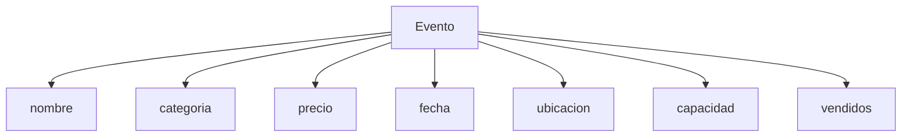
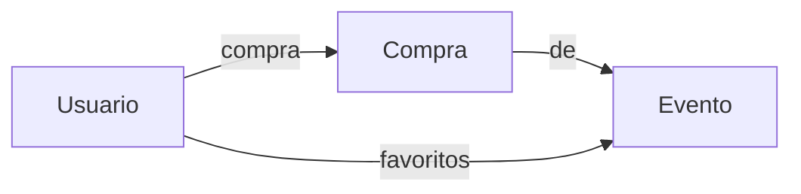
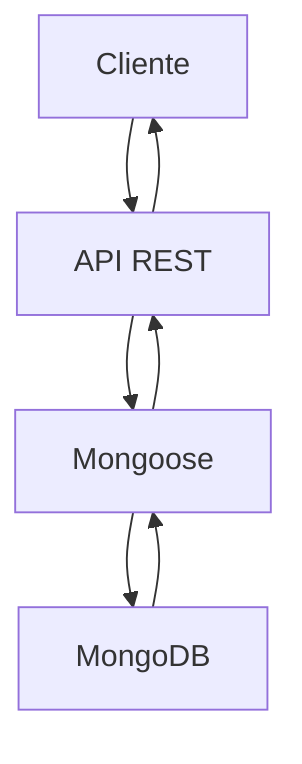

# 📱 Clase 05: MongoDB y Modelos de Datos

**Duración:** 4 horas  
**Objetivo:** Integrar MongoDB para persistencia de datos, crear modelos con Mongoose  
**Proyecto:** Base de datos para sistema de eventos

---

## 📚 Contenido

### 1. Fundamentos de MongoDB

MongoDB es una base de datos NoSQL orientada a documentos.

```bash
# Instalar MongoDB Community
# https://www.mongodb.com/try/download/community

# Iniciar MongoDB
mongod

# En otra terminal, conectar
mongosh

# Comandos básicos
show databases
use tufiesta
db.eventos.insertOne({ nombre: "Concierto", precio: 50 })
db.eventos.find()
```

### 2. Mongoose - ODM para MongoDB

```bash
npm install mongoose
```

**Conectar a MongoDB:**

```javascript
// config/database.js
const mongoose = require('mongoose');

const conectarDB = async () => {
    try {
        await mongoose.connect(process.env.MONGODB_URI || 'mongodb://localhost:27017/tufiesta');
        console.log('MongoDB conectado');
    } catch (error) {
        console.error('Error conectando a MongoDB:', error);
        process.exit(1);
    }
};

module.exports = conectarDB;
```

### 3. Esquemas y Modelos

```javascript
// models/Evento.js
const mongoose = require('mongoose');

const eventoSchema = new mongoose.Schema({
    nombre: {
        type: String,
        required: [true, 'El nombre es requerido'],
        minlength: 3,
        maxlength: 100
    },
    descripcion: {
        type: String,
        maxlength: 500
    },
    categoria: {
        type: String,
        enum: ['musica', 'deportes', 'cultura', 'teatro'],
        required: true
    },
    precio: {
        type: Number,
        required: true,
        min: 0
    },
    fecha: {
        type: Date,
        required: true
    },
    ubicacion: {
        type: String,
        required: true
    },
    capacidad: {
        type: Number,
        default: 100
    },
    vendidos: {
        type: Number,
        default: 0
    },
    imagen: String,
    createdAt: {
        type: Date,
        default: Date.now
    },
    updatedAt: {
        type: Date,
        default: Date.now
    }
});

// Middleware pre-save
eventoSchema.pre('save', function(next) {
    this.updatedAt = Date.now();
    next();
});

// Métodos de instancia
eventoSchema.methods.obtenerDisponibles = function() {
    return this.capacidad - this.vendidos;
};

// Métodos estáticos
eventoSchema.statics.obtenerPorCategoria = function(categoria) {
    return this.find({ categoria });
};

module.exports = mongoose.model('Evento', eventoSchema);
```

### 4. Relaciones entre Modelos

```javascript
// models/Usuario.js
const usuarioSchema = new mongoose.Schema({
    nombre: {
        type: String,
        required: true
    },
    email: {
        type: String,
        required: true,
        unique: true
    },
    password: {
        type: String,
        required: true
    },
    favoritos: [{
        type: mongoose.Schema.Types.ObjectId,
        ref: 'Evento'
    }],
    compras: [{
        type: mongoose.Schema.Types.ObjectId,
        ref: 'Compra'
    }],
    createdAt: {
        type: Date,
        default: Date.now
    }
});

module.exports = mongoose.model('Usuario', usuarioSchema);

// models/Compra.js
const compraSchema = new mongoose.Schema({
    usuario: {
        type: mongoose.Schema.Types.ObjectId,
        ref: 'Usuario',
        required: true
    },
    evento: {
        type: mongoose.Schema.Types.ObjectId,
        ref: 'Evento',
        required: true
    },
    cantidad: {
        type: Number,
        required: true,
        min: 1
    },
    total: {
        type: Number,
        required: true
    },
    estado: {
        type: String,
        enum: ['pendiente', 'confirmada', 'cancelada'],
        default: 'pendiente'
    },
    createdAt: {
        type: Date,
        default: Date.now
    }
});

module.exports = mongoose.model('Compra', compraSchema);
```

### 5. Operaciones CRUD con Mongoose

```javascript
// routes/eventos.js
const express = require('express');
const Evento = require('../models/Evento');
const router = express.Router();

// CREATE
router.post('/', async (req, res) => {
    try {
        const evento = new Evento(req.body);
        await evento.save();
        res.status(201).json(evento);
    } catch (error) {
        res.status(400).json({ error: error.message });
    }
});

// READ - Todos
router.get('/', async (req, res) => {
    try {
        const { categoria, precioMin, precioMax, page = 1, limit = 10 } = req.query;

        let filtro = {};
        if (categoria) filtro.categoria = categoria;
        if (precioMin || precioMax) {
            filtro.precio = {};
            if (precioMin) filtro.precio.$gte = parseFloat(precioMin);
            if (precioMax) filtro.precio.$lte = parseFloat(precioMax);
        }

        const eventos = await Evento.find(filtro)
            .limit(limit * 1)
            .skip((page - 1) * limit)
            .sort({ fecha: 1 });

        const total = await Evento.countDocuments(filtro);

        res.json({
            eventos,
            totalPages: Math.ceil(total / limit),
            currentPage: page
        });
    } catch (error) {
        res.status(500).json({ error: error.message });
    }
});

// READ - Por ID
router.get('/:id', async (req, res) => {
    try {
        const evento = await Evento.findById(req.params.id);
        if (!evento) {
            return res.status(404).json({ error: 'Evento no encontrado' });
        }
        res.json(evento);
    } catch (error) {
        res.status(500).json({ error: error.message });
    }
});

// UPDATE
router.put('/:id', async (req, res) => {
    try {
        const evento = await Evento.findByIdAndUpdate(
            req.params.id,
            req.body,
            { new: true, runValidators: true }
        );
        if (!evento) {
            return res.status(404).json({ error: 'Evento no encontrado' });
        }
        res.json(evento);
    } catch (error) {
        res.status(400).json({ error: error.message });
    }
});

// DELETE
router.delete('/:id', async (req, res) => {
    try {
        const evento = await Evento.findByIdAndDelete(req.params.id);
        if (!evento) {
            return res.status(404).json({ error: 'Evento no encontrado' });
        }
        res.json({ mensaje: 'Evento eliminado' });
    } catch (error) {
        res.status(500).json({ error: error.message });
    }
});

module.exports = router;
```

### 6. Agregaciones

```javascript
// Obtener estadísticas
router.get('/stats/resumen', async (req, res) => {
    try {
        const stats = await Evento.aggregate([
            {
                $group: {
                    _id: '$categoria',
                    total: { $sum: 1 },
                    precioPromedio: { $avg: '$precio' },
                    precioMax: { $max: '$precio' }
                }
            },
            { $sort: { total: -1 } }
        ]);
        res.json(stats);
    } catch (error) {
        res.status(500).json({ error: error.message });
    }
});

// Eventos más vendidos
router.get('/stats/top-vendidos', async (req, res) => {
    try {
        const topVendidos = await Evento.find()
            .sort({ vendidos: -1 })
            .limit(10);
        res.json(topVendidos);
    } catch (error) {
        res.status(500).json({ error: error.message });
    }
});
```

---

## 🎯 Ejercicio Práctico

### Objetivo
Crear API REST con MongoDB para gestionar eventos y usuarios.

### Paso 1: Instalar dependencias

```bash
npm install mongoose
npm install --save-dev mongodb-memory-server
```

### Paso 2: Configurar conexión

```javascript
// config/database.js
const mongoose = require('mongoose');

const conectarDB = async () => {
    try {
        const conn = await mongoose.connect(
            process.env.MONGODB_URI || 'mongodb://localhost:27017/tufiesta',
            {
                useNewUrlParser: true,
                useUnifiedTopology: true
            }
        );
        console.log(`MongoDB conectado: ${conn.connection.host}`);
        return conn;
    } catch (error) {
        console.error(`Error: ${error.message}`);
        process.exit(1);
    }
};

module.exports = conectarDB;
```

### Paso 3: Crear modelos

```javascript
// models/Evento.js
const mongoose = require('mongoose');

const eventoSchema = new mongoose.Schema({
    nombre: {
        type: String,
        required: [true, 'Nombre requerido'],
        trim: true
    },
    descripcion: String,
    categoria: {
        type: String,
        enum: ['musica', 'deportes', 'cultura', 'teatro'],
        required: true
    },
    precio: {
        type: Number,
        required: true,
        min: 0
    },
    fecha: {
        type: Date,
        required: true
    },
    ubicacion: String,
    capacidad: {
        type: Number,
        default: 100
    },
    vendidos: {
        type: Number,
        default: 0
    },
    createdAt: {
        type: Date,
        default: Date.now
    }
});

module.exports = mongoose.model('Evento', eventoSchema);
```

### Paso 4: Crear rutas

```javascript
// routes/eventos.js
const express = require('express');
const Evento = require('../models/Evento');
const router = express.Router();

// GET todos
router.get('/', async (req, res) => {
    try {
        const { categoria, page = 1, limit = 10 } = req.query;
        let filtro = {};
        if (categoria) filtro.categoria = categoria;

        const eventos = await Evento.find(filtro)
            .limit(limit)
            .skip((page - 1) * limit)
            .sort({ fecha: 1 });

        const total = await Evento.countDocuments(filtro);

        res.json({
            eventos,
            total,
            pages: Math.ceil(total / limit)
        });
    } catch (error) {
        res.status(500).json({ error: error.message });
    }
});

// GET por ID
router.get('/:id', async (req, res) => {
    try {
        const evento = await Evento.findById(req.params.id);
        if (!evento) return res.status(404).json({ error: 'No encontrado' });
        res.json(evento);
    } catch (error) {
        res.status(500).json({ error: error.message });
    }
});

// POST crear
router.post('/', async (req, res) => {
    try {
        const evento = new Evento(req.body);
        await evento.save();
        res.status(201).json(evento);
    } catch (error) {
        res.status(400).json({ error: error.message });
    }
});

// PUT actualizar
router.put('/:id', async (req, res) => {
    try {
        const evento = await Evento.findByIdAndUpdate(
            req.params.id,
            req.body,
            { new: true, runValidators: true }
        );
        if (!evento) return res.status(404).json({ error: 'No encontrado' });
        res.json(evento);
    } catch (error) {
        res.status(400).json({ error: error.message });
    }
});

// DELETE
router.delete('/:id', async (req, res) => {
    try {
        const evento = await Evento.findByIdAndDelete(req.params.id);
        if (!evento) return res.status(404).json({ error: 'No encontrado' });
        res.json({ mensaje: 'Eliminado' });
    } catch (error) {
        res.status(500).json({ error: error.message });
    }
});

module.exports = router;
```

### Paso 5: Integrar en servidor

```javascript
// index.js
const express = require('express');
const cors = require('cors');
require('dotenv').config();
const conectarDB = require('./config/database');
const eventosRouter = require('./routes/eventos');

const app = express();

// Conectar BD
conectarDB();

// Middleware
app.use(cors());
app.use(express.json());

// Rutas
app.use('/api/eventos', eventosRouter);

// Iniciar
const PORT = process.env.PORT || 3000;
app.listen(PORT, () => {
    console.log(`Servidor en puerto ${PORT}`);
});
```

### Paso 6: Probar

```bash
npm run dev

# En otra terminal
curl http://localhost:3000/api/eventos

curl -X POST http://localhost:3000/api/eventos \
  -H "Content-Type: application/json" \
  -d '{
    "nombre": "Concierto",
    "categoria": "musica",
    "precio": 50,
    "fecha": "2024-12-25",
    "ubicacion": "Estadio"
  }'
```

---

## 📊 Diagramas

### Estructura de Datos



### Relaciones



### Flujo de Datos



---

## 📝 Resumen

- ✅ MongoDB configurado
- ✅ Mongoose para modelos
- ✅ Esquemas con validación
- ✅ Relaciones entre modelos
- ✅ CRUD completo
- ✅ Paginación y filtrado

---

## 🎓 Preguntas de Repaso

**P1:** ¿Cuál es la diferencia entre SQL y NoSQL?  
**R1:** SQL es relacional, NoSQL es orientado a documentos sin esquema fijo.

**P2:** ¿Qué es Mongoose?  
**R2:** ODM (Object Document Mapper) que facilita trabajar con MongoDB desde Node.js.

**P3:** ¿Cómo validar datos en Mongoose?  
**R3:** Usando propiedades `required`, `min`, `max`, `enum` en el esquema.

**P4:** ¿Qué es populate?  
**R4:** Método para reemplazar referencias con documentos completos.

**P5:** ¿Cómo hacer paginación?  
**R5:** Usar `skip()` y `limit()` en las queries.

---

## 🚀 Próxima Clase

**Clase 06: Autenticación, JWT y Seguridad**

Implementar autenticación con JWT y mejores prácticas de seguridad.

---

**Última actualización:** 2024  
**Tiempo estimado:** 4 horas  
**Complejidad:** ⭐⭐ (Intermedio)
