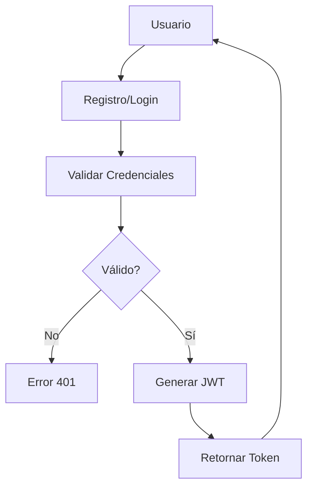
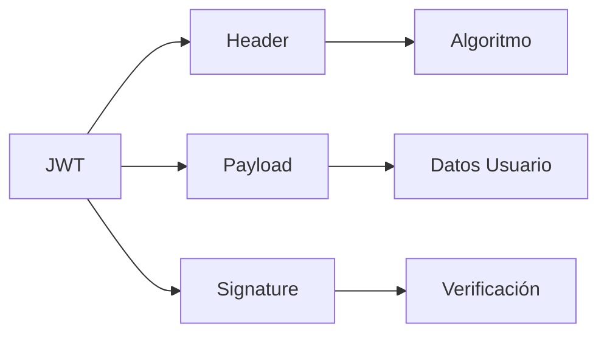
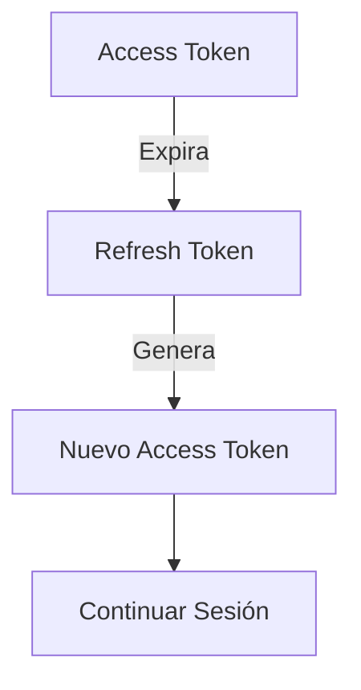

# 📱 Clase 06: Autenticación, JWT y Seguridad

**Duración:** 4 horas  
**Objetivo:** Implementar autenticación con JWT, hash de contraseñas y seguridad  
**Proyecto:** Sistema de autenticación para eventos

---

## 📚 Contenido

### 1. Fundamentos de Autenticación

Autenticación verifica quién eres. Autorización verifica qué puedes hacer.

```bash
npm install jsonwebtoken bcryptjs
```

### 2. Hash de Contraseñas con bcrypt

```javascript
// models/Usuario.js
const mongoose = require('mongoose');
const bcrypt = require('bcryptjs');

const usuarioSchema = new mongoose.Schema({
    nombre: {
        type: String,
        required: true
    },
    email: {
        type: String,
        required: true,
        unique: true,
        lowercase: true
    },
    password: {
        type: String,
        required: true,
        minlength: 6
    },
    rol: {
        type: String,
        enum: ['usuario', 'admin'],
        default: 'usuario'
    },
    createdAt: {
        type: Date,
        default: Date.now
    }
});

// Hash de contraseña antes de guardar
usuarioSchema.pre('save', async function(next) {
    if (!this.isModified('password')) return next();

    try {
        const salt = await bcrypt.genSalt(10);
        this.password = await bcrypt.hash(this.password, salt);
        next();
    } catch (error) {
        next(error);
    }
});

// Método para comparar contraseñas
usuarioSchema.methods.compararPassword = async function(passwordIngresada) {
    return await bcrypt.compare(passwordIngresada, this.password);
};

module.exports = mongoose.model('Usuario', usuarioSchema);
```

### 3. JWT - JSON Web Tokens

```javascript
// utils/jwt.js
const jwt = require('jsonwebtoken');

const generarToken = (usuarioId) => {
    return jwt.sign(
        { id: usuarioId },
        process.env.JWT_SECRET || 'tu-secreto-super-seguro',
        { expiresIn: '24h' }
    );
};

const generarRefreshToken = (usuarioId) => {
    return jwt.sign(
        { id: usuarioId },
        process.env.REFRESH_TOKEN_SECRET || 'tu-refresh-secreto',
        { expiresIn: '7d' }
    );
};

const verificarToken = (token) => {
    try {
        return jwt.verify(token, process.env.JWT_SECRET || 'tu-secreto-super-seguro');
    } catch (error) {
        return null;
    }
};

module.exports = {
    generarToken,
    generarRefreshToken,
    verificarToken
};
```

### 4. Middleware de Autenticación

```javascript
// middleware/autenticacion.js
const { verificarToken } = require('../utils/jwt');

const autenticar = (req, res, next) => {
    try {
        const token = req.headers.authorization?.split(' ')[1];

        if (!token) {
            return res.status(401).json({ error: 'Token no proporcionado' });
        }

        const decoded = verificarToken(token);
        if (!decoded) {
            return res.status(401).json({ error: 'Token inválido' });
        }

        req.usuarioId = decoded.id;
        next();
    } catch (error) {
        res.status(401).json({ error: 'No autorizado' });
    }
};

const autorizarAdmin = (req, res, next) => {
    if (req.usuarioRol !== 'admin') {
        return res.status(403).json({ error: 'Acceso denegado' });
    }
    next();
};

module.exports = { autenticar, autorizarAdmin };
```

### 5. Rutas de Autenticación

```javascript
// routes/auth.js
const express = require('express');
const Usuario = require('../models/Usuario');
const { generarToken, generarRefreshToken } = require('../utils/jwt');
const { autenticar } = require('../middleware/autenticacion');
const router = express.Router();

// REGISTRO
router.post('/registro', async (req, res) => {
    try {
        const { nombre, email, password } = req.body;

        // Validar
        if (!nombre || !email || !password) {
            return res.status(400).json({ error: 'Faltan campos' });
        }

        // Verificar si existe
        const usuarioExistente = await Usuario.findOne({ email });
        if (usuarioExistente) {
            return res.status(400).json({ error: 'Email ya registrado' });
        }

        // Crear usuario
        const usuario = new Usuario({ nombre, email, password });
        await usuario.save();

        // Generar tokens
        const token = generarToken(usuario._id);
        const refreshToken = generarRefreshToken(usuario._id);

        res.status(201).json({
            usuario: {
                id: usuario._id,
                nombre: usuario.nombre,
                email: usuario.email
            },
            token,
            refreshToken
        });
    } catch (error) {
        res.status(500).json({ error: error.message });
    }
});

// LOGIN
router.post('/login', async (req, res) => {
    try {
        const { email, password } = req.body;

        // Validar
        if (!email || !password) {
            return res.status(400).json({ error: 'Email y contraseña requeridos' });
        }

        // Buscar usuario
        const usuario = await Usuario.findOne({ email });
        if (!usuario) {
            return res.status(401).json({ error: 'Credenciales inválidas' });
        }

        // Verificar contraseña
        const esValida = await usuario.compararPassword(password);
        if (!esValida) {
            return res.status(401).json({ error: 'Credenciales inválidas' });
        }

        // Generar tokens
        const token = generarToken(usuario._id);
        const refreshToken = generarRefreshToken(usuario._id);

        res.json({
            usuario: {
                id: usuario._id,
                nombre: usuario.nombre,
                email: usuario.email
            },
            token,
            refreshToken
        });
    } catch (error) {
        res.status(500).json({ error: error.message });
    }
});

// REFRESH TOKEN
router.post('/refresh', (req, res) => {
    try {
        const { refreshToken } = req.body;

        if (!refreshToken) {
            return res.status(400).json({ error: 'Refresh token requerido' });
        }

        const decoded = jwt.verify(
            refreshToken,
            process.env.REFRESH_TOKEN_SECRET || 'tu-refresh-secreto'
        );

        const nuevoToken = generarToken(decoded.id);
        res.json({ token: nuevoToken });
    } catch (error) {
        res.status(401).json({ error: 'Refresh token inválido' });
    }
});

// PERFIL (requiere autenticación)
router.get('/perfil', autenticar, async (req, res) => {
    try {
        const usuario = await Usuario.findById(req.usuarioId).select('-password');
        res.json(usuario);
    } catch (error) {
        res.status(500).json({ error: error.message });
    }
});

module.exports = router;
```

### 6. Seguridad - OWASP Top 10

```javascript
// Validación de entrada
const Joi = require('joi');

const esquemaRegistro = Joi.object({
    nombre: Joi.string().min(3).max(100).required(),
    email: Joi.string().email().required(),
    password: Joi.string().min(8).pattern(/[A-Z]/).pattern(/[0-9]/).required()
});

// Rate limiting
const rateLimit = require('express-rate-limit');

const limitador = rateLimit({
    windowMs: 15 * 60 * 1000, // 15 minutos
    max: 100 // límite de 100 requests por ventana
});

app.use('/api/auth/login', limitador);

// CORS
const cors = require('cors');
app.use(cors({
    origin: process.env.ALLOWED_ORIGINS?.split(',') || ['http://localhost:3000'],
    credentials: true
}));

// Helmet - Headers de seguridad
const helmet = require('helmet');
app.use(helmet());

// Sanitización
const mongoSanitize = require('express-mongo-sanitize');
app.use(mongoSanitize());
```

---

## 🎯 Ejercicio Práctico

### Objetivo
Implementar sistema completo de autenticación con JWT.

### Paso 1: Instalar dependencias

```bash
npm install jsonwebtoken bcryptjs joi helmet express-rate-limit express-mongo-sanitize
```

### Paso 2: Crear modelo Usuario

```javascript
// models/Usuario.js
const mongoose = require('mongoose');
const bcrypt = require('bcryptjs');

const usuarioSchema = new mongoose.Schema({
    nombre: {
        type: String,
        required: [true, 'Nombre requerido'],
        trim: true
    },
    email: {
        type: String,
        required: [true, 'Email requerido'],
        unique: true,
        lowercase: true,
        match: [/^\w+([\.-]?\w+)*@\w+([\.-]?\w+)*(\.\w{2,3})+$/, 'Email inválido']
    },
    password: {
        type: String,
        required: [true, 'Contraseña requerida'],
        minlength: 6,
        select: false
    },
    rol: {
        type: String,
        enum: ['usuario', 'admin'],
        default: 'usuario'
    },
    createdAt: {
        type: Date,
        default: Date.now
    }
});

// Hash password
usuarioSchema.pre('save', async function(next) {
    if (!this.isModified('password')) return next();
    this.password = await bcrypt.hash(this.password, 10);
    next();
});

// Comparar password
usuarioSchema.methods.compararPassword = async function(pwd) {
    return await bcrypt.compare(pwd, this.password);
};

module.exports = mongoose.model('Usuario', usuarioSchema);
```

### Paso 3: Crear utilidades JWT

```javascript
// utils/jwt.js
const jwt = require('jsonwebtoken');

const generarToken = (id) => {
    return jwt.sign({ id }, process.env.JWT_SECRET || 'secreto', {
        expiresIn: '24h'
    });
};

const verificarToken = (token) => {
    try {
        return jwt.verify(token, process.env.JWT_SECRET || 'secreto');
    } catch {
        return null;
    }
};

module.exports = { generarToken, verificarToken };
```

### Paso 4: Crear middleware

```javascript
// middleware/autenticacion.js
const { verificarToken } = require('../utils/jwt');

const autenticar = (req, res, next) => {
    const token = req.headers.authorization?.split(' ')[1];
    if (!token) return res.status(401).json({ error: 'No autorizado' });

    const decoded = verificarToken(token);
    if (!decoded) return res.status(401).json({ error: 'Token inválido' });

    req.usuarioId = decoded.id;
    next();
};

module.exports = { autenticar };
```

### Paso 5: Crear rutas

```javascript
// routes/auth.js
const express = require('express');
const Usuario = require('../models/Usuario');
const { generarToken } = require('../utils/jwt');
const { autenticar } = require('../middleware/autenticacion');
const router = express.Router();

// Registro
router.post('/registro', async (req, res) => {
    try {
        const { nombre, email, password } = req.body;

        if (await Usuario.findOne({ email })) {
            return res.status(400).json({ error: 'Email ya existe' });
        }

        const usuario = await Usuario.create({ nombre, email, password });
        const token = generarToken(usuario._id);

        res.status(201).json({
            usuario: { id: usuario._id, nombre, email },
            token
        });
    } catch (error) {
        res.status(400).json({ error: error.message });
    }
});

// Login
router.post('/login', async (req, res) => {
    try {
        const { email, password } = req.body;

        const usuario = await Usuario.findOne({ email }).select('+password');
        if (!usuario || !(await usuario.compararPassword(password))) {
            return res.status(401).json({ error: 'Credenciales inválidas' });
        }

        const token = generarToken(usuario._id);
        res.json({
            usuario: { id: usuario._id, nombre: usuario.nombre, email },
            token
        });
    } catch (error) {
        res.status(500).json({ error: error.message });
    }
});

// Perfil
router.get('/perfil', autenticar, async (req, res) => {
    try {
        const usuario = await Usuario.findById(req.usuarioId);
        res.json(usuario);
    } catch (error) {
        res.status(500).json({ error: error.message });
    }
});

module.exports = router;
```

### Paso 6: Integrar en servidor

```javascript
// index.js
const express = require('express');
const helmet = require('helmet');
const cors = require('cors');
require('dotenv').config();
const conectarDB = require('./config/database');
const authRouter = require('./routes/auth');

const app = express();

conectarDB();

app.use(helmet());
app.use(cors());
app.use(express.json());

app.use('/api/auth', authRouter);

app.listen(3000, () => console.log('Servidor en puerto 3000'));
```

### Paso 7: Probar

```bash
# Registro
curl -X POST http://localhost:3000/api/auth/registro \
  -H "Content-Type: application/json" \
  -d '{"nombre":"Juan","email":"juan@example.com","password":"Password123"}'

# Login
curl -X POST http://localhost:3000/api/auth/login \
  -H "Content-Type: application/json" \
  -d '{"email":"juan@example.com","password":"Password123"}'

# Perfil (con token)
curl http://localhost:3000/api/auth/perfil \
  -H "Authorization: Bearer <token>"
```

---

## 📊 Diagramas

### Flujo de Autenticación



### Estructura JWT



### Ciclo de Tokens



---

## 📝 Resumen

- ✅ Hash de contraseñas con bcrypt
- ✅ JWT para autenticación
- ✅ Refresh tokens
- ✅ Middleware de autenticación
- ✅ Seguridad OWASP
- ✅ Rate limiting

---

## 🎓 Preguntas de Repaso

**P1:** ¿Por qué hashear contraseñas?  
**R1:** Para que si la BD se compromete, las contraseñas no sean legibles.

**P2:** ¿Cuál es la diferencia entre JWT y sesiones?  
**R2:** JWT es stateless, sesiones requieren almacenamiento en servidor.

**P3:** ¿Qué es un refresh token?  
**R3:** Token de larga duración para obtener nuevos access tokens sin re-autenticar.

**P4:** ¿Cómo proteger contra ataques?  
**R4:** Validar entrada, usar HTTPS, rate limiting, CORS, helmet.

**P5:** ¿Dónde guardar el JWT en cliente?  
**R5:** En localStorage o sessionStorage (cuidado con XSS).

---

## 🚀 Próxima Clase

**Clase 07: Promesas, Async/Await y Callbacks**

Dominar programación asincrónica en JavaScript.

---

**Última actualización:** 2024  
**Tiempo estimado:** 4 horas  
**Complejidad:** ⭐⭐⭐ (Avanzada)
