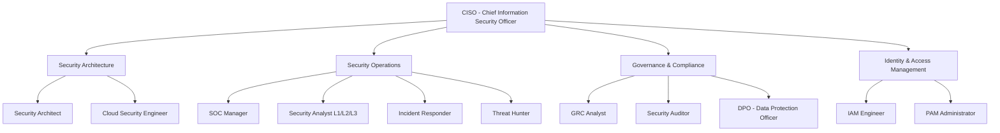
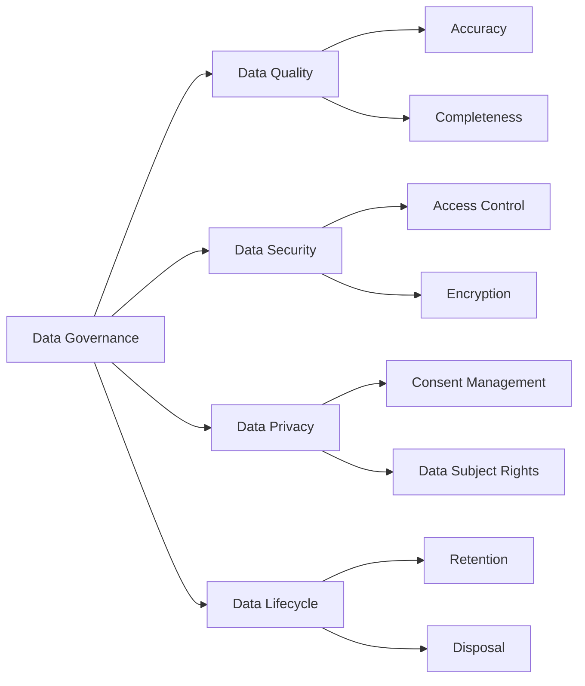
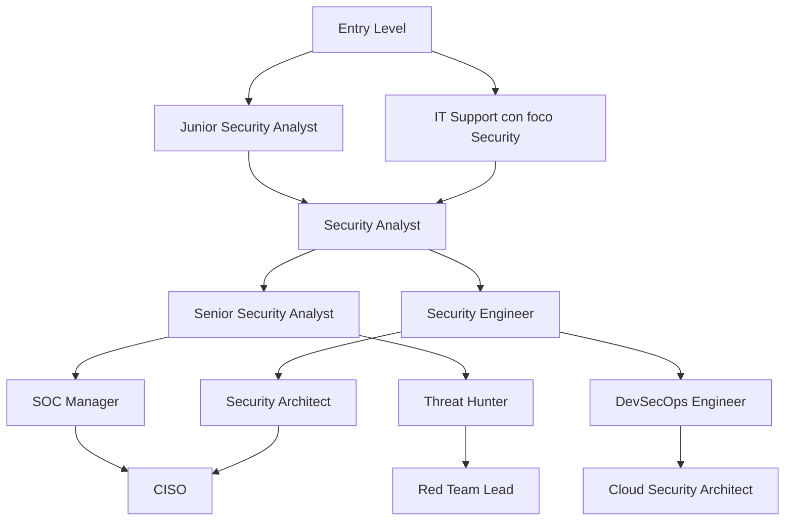

# CURSO COMPLETO DE CIBERSEGURIDAD - PARTE 11

## MÓDULO 15: ROLES Y RESPONSABILIDADES EN CIBERSEGURIDAD

### 15.1 Organigrama de Seguridad



### 15.2 Roles de Ciberseguridad

#### 15.2.1 CISO (Chief Information Security Officer)

**Responsabilidades:**
- Definir estrategia de seguridad
- Gestionar presupuesto de seguridad
- Reportar a C-Level y Board
- Gestionar riesgos empresariales
- Supervisar cumplimiento normativo

**Habilidades requeridas:**
- Liderazgo y gestión
- Conocimiento técnico profundo
- Gestión de riesgos
- Comunicación ejecutiva
- Conocimiento de negocio

**Salario promedio (Uruguay):** $150,000 - $250,000 USD/año

**Recursos:**
- 📺 [What does a CISO do?](https://www.youtube.com/watch?v=example)
- 📄 [CISO Mindmap](https://www.rafeeqrehman.com/ciso-mindmap/)

---

#### 15.2.2 Security Architect

**Responsabilidades:**
- Diseñar arquitectura de seguridad
- Definir estándares técnicos
- Evaluar nuevas tecnologías
- Threat modeling
- Revisión de diseño de sistemas

**Habilidades requeridas:**
- Arquitectura de sistemas
- Cloud (AWS, Azure, GCP)
- Redes y protocolos
- Criptografía
- DevSecOps

**Herramientas:**
- TOGAF, SABSA
- Threat modeling (STRIDE, PASTA)
- Diagramas (Draw.io, Lucidchart)

**Salario promedio:** $80,000 - $150,000 USD/año

**Recursos:**
- 📺 [Security Architecture Basics](https://www.youtube.com/watch?v=example)
- 📄 [OWASP Threat Modeling](https://owasp.org/www-community/Threat_Modeling)

---

#### 15.2.3 SOC Analyst (Security Operations Center)

**Niveles:**

**L1 - Triage:**
- Monitorear alertas de SIEM
- Clasificar incidentes
- Escalamiento a L2
- Documentación básica

**L2 - Investigación:**
- Análisis profundo de alertas
- Correlación de eventos
- Respuesta inicial
- Crear playbooks

**L3 - Threat Hunter:**
- Búsqueda proactiva de amenazas
- Análisis de malware
- Desarrollo de detecciones
- Mejora de procesos

**Herramientas:**
- SIEM (Splunk, ELK, QRadar)
- EDR (CrowdStrike, SentinelOne)
- SOAR (Palo Alto Cortex, Splunk Phantom)
- Threat Intelligence (MISP, ThreatConnect)

**Salario promedio:**
- L1: $30,000 - $50,000 USD/año
- L2: $50,000 - $80,000 USD/año
- L3: $80,000 - $120,000 USD/año

**Recursos:**
- 📺 [Day in the Life of SOC Analyst](https://www.youtube.com/watch?v=example)
- 📄 [SOC Career Path](https://www.cyberseek.org/pathway.html)

---

#### 15.2.4 Penetration Tester (Ethical Hacker)

**Responsabilidades:**
- Realizar pentesting
- Identificar vulnerabilidades
- Explotar sistemas (autorizado)
- Reportar hallazgos
- Recomendar remediaciones

**Tipos:**
- **Red Team:** Simula atacantes reales
- **Blue Team:** Defiende sistemas
- **Purple Team:** Colaboración Red + Blue

**Herramientas:**
- Kali Linux
- Metasploit, Burp Suite
- Nmap, Wireshark
- Cobalt Strike, Empire

**Certificaciones:**
- OSCP (Offensive Security Certified Professional)
- CEH (Certified Ethical Hacker)
- GPEN (GIAC Penetration Tester)

**Salario promedio:** $70,000 - $130,000 USD/año

**Recursos:**
- 📺 [Pentesting Full Course](https://www.youtube.com/watch?v=example)
- 📄 [HackTheBox](https://www.hackthebox.com)

---

#### 15.2.5 Security Engineer

**Responsabilidades:**
- Implementar controles de seguridad
- Configurar herramientas (firewall, IDS/IPS)
- Hardening de sistemas
- Automatización de seguridad
- Gestión de vulnerabilidades

**Habilidades:**
- Scripting (Python, Bash, PowerShell)
- Redes y sistemas operativos
- Cloud security
- CI/CD y DevSecOps
- Infraestructura como código

**Salario promedio:** $60,000 - $100,000 USD/año

---

### 15.3 Roles de Datos y Privacidad

#### 15.3.1 DPO (Data Protection Officer)

**Responsabilidades:**
- Supervisar cumplimiento GDPR/Ley 18.331
- Asesorar en protección de datos
- Punto de contacto con autoridades
- Gestionar brechas de datos
- Capacitación en privacidad

**Requerido por ley cuando:**
- Procesamiento a gran escala
- Datos sensibles (salud, biometría)
- Monitoreo sistemático

**Habilidades:**
- Conocimiento legal (GDPR, leyes locales)
- Gestión de riesgos
- Comunicación
- Ética

**Salario promedio:** $70,000 - $120,000 USD/año

**Recursos:**
- 📺 [Role of DPO](https://www.youtube.com/watch?v=example)
- 📄 [IAPP - DPO Certification](https://iapp.org/certify/cipdpo/)

---

#### 15.3.2 Data Governance Manager

**Responsabilidades:**
- Definir políticas de datos
- Clasificación de datos
- Gestión de calidad de datos
- Linaje de datos
- Cumplimiento normativo

**Framework:**


---

#### 15.3.3 Data Steward

**Responsabilidades:**
- Custodio de datos específicos
- Definir reglas de negocio
- Resolver problemas de calidad
- Aprobar accesos
- Documentar metadatos

**Por dominio:**
- Customer Data Steward
- Financial Data Steward
- Product Data Steward

---

#### 15.3.4 Privacy Engineer

**Responsabilidades:**
- Implementar Privacy by Design
- Anonimización y pseudonimización
- Gestión de consentimientos
- Evaluaciones de impacto (DPIA)
- Herramientas de privacidad

**Técnicas:**
- K-anonymity
- Differential privacy
- Tokenización
- Data masking

**Recursos:**
- 📺 [Privacy Engineering](https://www.youtube.com/watch?v=example)
- 📄 [NIST Privacy Framework](https://www.nist.gov/privacy-framework)

---

### 15.4 Matriz de Responsabilidades (RACI)

```
┌────────────────────────────────────────────────────────────┐
│         MATRIZ RACI - GESTIÓN DE INCIDENTES               │
└────────────────────────────────────────────────────────────┘

Actividad                    CISO  Architect  SOC  Engineer  DPO
─────────────────────────────────────────────────────────────────
Detectar incidente            I      I        R      C        I
Clasificar severidad          C      C        R      I        C
Contener amenaza              I      C        A      R        I
Análisis forense              I      C        R      R        I
Notificar brecha de datos     A      I        C      I        R
Comunicar a dirección         R      I        C      I        C
Lecciones aprendidas          A      R        C      C        C

R = Responsible (Ejecuta)
A = Accountable (Aprueba)
C = Consulted (Consultado)
I = Informed (Informado)
```

---

### 15.5 Career Path en Ciberseguridad



**Timeline típico:**
- Entry → Junior: 0-2 años
- Junior → Mid: 2-4 años
- Mid → Senior: 4-7 años
- Senior → Lead/Manager: 7-10 años
- Manager → CISO: 10-15 años

---

### 15.6 Habilidades por Rol

#### Habilidades Técnicas

```
┌────────────────────────────────────────────────────────────┐
│              SKILL MATRIX                                  │
└────────────────────────────────────────────────────────────┘

Skill                  CISO  Architect  SOC  Pentester  DPO
──────────────────────────────────────────────────────────────
Networking              ⭐⭐   ⭐⭐⭐⭐⭐  ⭐⭐⭐  ⭐⭐⭐⭐⭐  ⭐⭐
Operating Systems       ⭐⭐   ⭐⭐⭐⭐   ⭐⭐⭐⭐ ⭐⭐⭐⭐⭐  ⭐
Programming             ⭐    ⭐⭐⭐⭐   ⭐⭐⭐  ⭐⭐⭐⭐⭐  ⭐
Cloud (AWS/Azure)       ⭐⭐   ⭐⭐⭐⭐⭐  ⭐⭐⭐  ⭐⭐⭐    ⭐
Legal/Compliance        ⭐⭐⭐⭐ ⭐⭐     ⭐⭐   ⭐⭐     ⭐⭐⭐⭐⭐
Risk Management         ⭐⭐⭐⭐⭐ ⭐⭐⭐⭐   ⭐⭐⭐  ⭐⭐⭐    ⭐⭐⭐⭐
Incident Response       ⭐⭐⭐  ⭐⭐⭐    ⭐⭐⭐⭐⭐ ⭐⭐⭐⭐   ⭐⭐
Cryptography            ⭐⭐   ⭐⭐⭐⭐⭐  ⭐⭐   ⭐⭐⭐⭐   ⭐⭐
```

#### Habilidades Blandas

**CISO:**
- Liderazgo ejecutivo
- Comunicación con board
- Gestión de presupuesto
- Negociación

**Architect:**
- Pensamiento sistémico
- Documentación técnica
- Mentoría
- Innovación

**SOC Analyst:**
- Trabajo bajo presión
- Atención al detalle
- Trabajo en equipo
- Comunicación escrita

**Pentester:**
- Pensamiento creativo
- Persistencia
- Ética profesional
- Reporte técnico

**DPO:**
- Diplomacia
- Interpretación legal
- Capacitación
- Mediación

---

### 15.7 Certificaciones por Rol

```
┌────────────────────────────────────────────────────────────┐
│         CERTIFICACIONES RECOMENDADAS                       │
└────────────────────────────────────────────────────────────┘

CISO
├─ CISSP (Certified Information Systems Security Professional)
├─ CISM (Certified Information Security Manager)
└─ CGEIT (Certified in Governance of Enterprise IT)

Security Architect
├─ CISSP-ISSAP (Architecture)
├─ SABSA (Sherwood Applied Business Security Architecture)
└─ AWS/Azure Security Specialty

SOC Analyst
├─ CompTIA Security+
├─ GCIA (GIAC Certified Intrusion Analyst)
└─ Splunk Certified Power User

Pentester
├─ OSCP (Offensive Security Certified Professional)
├─ CEH (Certified Ethical Hacker)
└─ GPEN (GIAC Penetration Tester)

DPO
├─ CIPP/E (Certified Information Privacy Professional/Europe)
├─ CIPM (Certified Information Privacy Manager)
└─ ISO 27701 Lead Implementer
```

**Recursos:**
- 📺 [Cybersecurity Certifications Roadmap](https://www.youtube.com/watch?v=example)
- 📄 [Paul Jerimy Security Certification Roadmap](https://pauljerimy.com/security-certification-roadmap/)

---

### 15.8 Salarios por Región (2024)

```
┌────────────────────────────────────────────────────────────┐
│         SALARIOS ANUALES (USD)                             │
└────────────────────────────────────────────────────────────┘

Rol                    Uruguay    Argentina   USA      Europa
──────────────────────────────────────────────────────────────
CISO                   150-250K   100-180K    200-400K 150-300K
Security Architect     80-150K    60-120K     150-250K 100-180K
Senior SOC Analyst     50-80K     40-70K      80-120K  60-100K
Pentester              70-130K    50-100K     100-180K 80-150K
Security Engineer      60-100K    45-80K      90-150K  70-120K
DPO                    70-120K    50-90K      100-160K 80-140K
```

---

### 15.9 Recursos de Aprendizaje

**Plataformas:**
- 📺 [Cybrary](https://www.cybrary.it)
- 📺 [INE Security](https://ine.com)
- 📺 [Pluralsight](https://www.pluralsight.com/browse/information-cyber-security)
- 📺 [Udemy - Cybersecurity Courses](https://www.udemy.com/topic/cyber-security/)

**Práctica:**
- 🔬 [HackTheBox](https://www.hackthebox.com)
- 🔬 [TryHackMe](https://tryhackme.com)
- 🔬 [PentesterLab](https://pentesterlab.com)
- 🔬 [PortSwigger Academy](https://portswigger.net/web-security)

**Comunidades:**
- 💬 [r/cybersecurity](https://reddit.com/r/cybersecurity)
- 💬 [OWASP Uruguay](https://owasp.org/www-chapter-uruguay/)
- 💬 [Discord - Cybersecurity](https://discord.gg/cybersecurity)

**Podcasts:**
- 🎙️ [Darknet Diaries](https://darknetdiaries.com)
- 🎙️ [Security Now](https://twit.tv/shows/security-now)
- 🎙️ [Risky Business](https://risky.biz)

