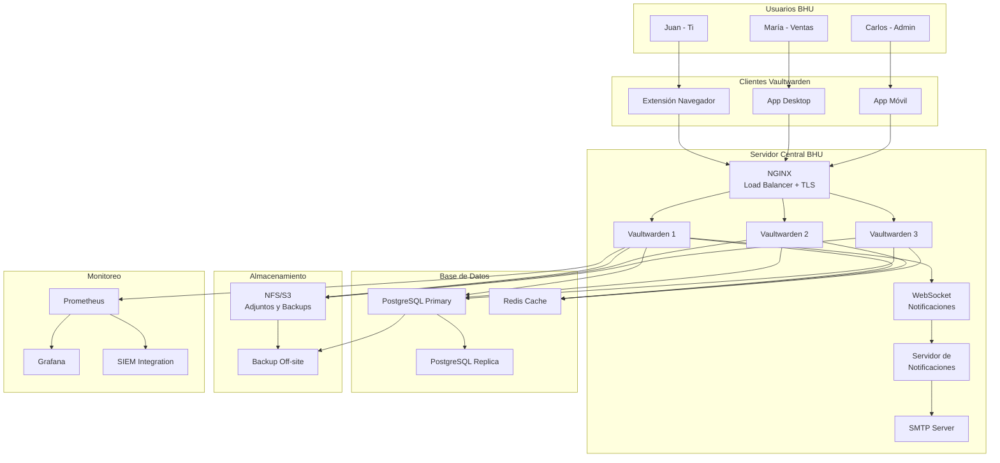

# 4.1 Solución Completa para BHU

## Arquitectura Híbrida: Contraseñas Locales + Servidor Central de Notificaciones

### Concepto

La arquitectura híbrida combina lo mejor de ambos mundos:

```
┌─────────────────────────────────────────────────────────────────────────┐
│                    ARQUITECTURA HÍBRIDA BHU                             │
├─────────────────────────────────────────────────────────────────────────┤
│                                                                         │
│  PARTE LOCAL (Cada Usuario)                                            │
│  ┌─────────────────────────────────────────────────────────────┐       │
│  │  Vaultwarden Client (Desktop/Móvil)                         │       │
│  │  ┌───────────────────────────────────────────────────────┐  │       │
│  │  │  Vault Local Cifrado (vault.db)                       │  │       │
│  │  │  - Contraseñas del usuario                           │  │       │
│  │  │  - API keys personales                               │  │       │
│  │  │  - Notas seguras                                     │  │       │
│  │  │  - Cifrado: AES-256-GCM                             │  │       │
│  │  │  - Clave: derivada de Master Password                 │  │       │
│  │  └───────────────────────────────────────────────────────┘  │       │
│  │                                                             │       │
│  │  Ventajas:                                                  │       │
│  │  ✅ Contraseñas siempre disponibles (sin internet)        │       │
│  │  ✅ Control total del usuario                              │       │
│  │  ✅ Velocidad instantánea de acceso                        │       │
│  │  ✅ Sin punto único de fallo                               │       │
│  └─────────────────────────────────────────────────────────────┘       │
│                          │                                              │
│                          │ Sync (cuando hay conexión)                  │
│                          ▼                                              │
│  PARTE CENTRAL (Servidor BHU)                                          │
│  ┌─────────────────────────────────────────────────────────────┐       │
│  │  Vaultwarden Server                                       │       │
│  │  ┌───────────────┐  ┌───────────────────────────────────┐  │       │
│  │  │   Notificador │  │   Registro de Uso                  │  │       │
│  │  │   de Eventos  │  │   (Audit Log)                      │  │       │
│  │  └───────┬───────┘  └───────────────────────────────────┘  │       │
│  │          │                                                  │       │
│  │          ▼                                                  │       │
│  │  ┌───────────────────────────────────────────────────────┐  │       │
│  │  │  Notificaciones                                      │  │       │
│  │  │  - Email: "Tu contraseña X fue usada"                │  │       │
│  │  │  - Email: "Contraseña X fue cambiada"                │  │       │
│  │  │  - Email: "Nuevo dispositivo detectado"              │  │       │
│  │  │  - Email: "2FA fue deshabilitado (alerta)"           │  │       │
│  │  └───────────────────────────────────────────────────────┘  │       │
│  │                                                             │       │
│  │  Ventajas del servidor central:                             │       │
│  │  ✅ Registro centralizado de actividad                     │       │
│  │  ✅ Notificaciones por email                               │       │
│  │  ✅ Sincronización entre dispositivos                      │       │
│  │  ✅ Compartición de contraseñas entre departamentos       │       │
│  │  ✅ Auditoría y cumplimiento                               │       │
│  └─────────────────────────────────────────────────────────────┘       │
│                                                                         │
└─────────────────────────────────────────────────────────────────────────┘
```

### Flujo de Datos

```
FLUJO NORMAL (Sin internet):
┌──────────┐                    ┌──────────┐
│  Usuario │                    │  Vault   │
│  Local   │  1. Master Pass    │  Local   │
│          │───────────────────►│ (cifrado)│
│          │                    │          │
│          │  2. Descifra vault │          │
│          │◄───────────────────│          │
│          │                    │          │
│  3. Accede a contraseña       │          │
│  sin necesidad de servidor   │          │
└──────────┘                    └──────────┘

FLUJO CON CONEXIÓN:
┌──────────┐    ┌──────────┐    ┌──────────┐
│  Usuario │    │  Vault   │    │ Servidor │
│  Local   │    │  Local   │    │ Central  │
├──────────┤    ├──────────┤    ├──────────┤
│          │ 1. Sync       │          │
│          │──────────────►│ 2. Sync   │
│          │               │──────────►│
│          │               │          │
│          │ 3. Datos      │ 4. Registra│
│          │ actualizados  │ evento    │
│          │◄──────────────│◄──────────│
│          │               │          │
│          │               │ 5. Envía  │
│          │               │ notificación│
│          │               │          │
│          │ 6. Email:     │──────────►│ Email
│          │ "Contraseña   │          │
│          │  fue usada"   │          │
└──────────┘               └──────────┘
```

## Diagrama de Arquitectura Completa



## Configuración de Notificaciones

### Opción 1: Notificación por Correo (Recomendada)

```
CONFIGURACIÓN EN .env:
SMTP_HOST=smtp.gmail.com
SMTP_PORT=587
SMTP_USERNAME=notificaciones@bhu.uy
SMTP_PASSWORD=[app password de Gmail]
SMTP_SECURITY=starttls
SMTP_FROM=notificaciones@bhu.uy
SMTP_FROM_NAME=BHU Vaultwarden

NOTIFICACIONES HABILITADAS:
✅ Password used (contraseña utilizada)
✅ Password changed (contraseña cambiada)
✅ Password shared (contraseña compartida)
✅ New device login (nuevo dispositivo)
✅ Failed login attempt (login fallido)
✅ 2FA disabled (2FA deshabilitado)
✅ Vault exported (vault exportado)
```

### Opción 2: Notificación por Webhook (Avanzada)

```
CONFIGURACIÓN PERSONALIZADA:
- Endpoint: https://bhu.uy/api/vaultwarden-webhook
- Método: POST
- Headers: Authorization: Bearer [token]
- Payload: JSON con evento

EVENTOS QUE SE ENVÍAN:
{
  "event": "password_used",
  "user": "juan.perez@bhu.uy",
  "cipher_name": "GitHub BHU",
  "ip_address": "192.168.1.100",
  "device": "Chrome on Windows",
  "timestamp": "2024-01-15T14:30:00Z"
}

DESTINOS POSIBLES:
- Slack channel: #vaultwarden-alerts
- Microsoft Teams webhook
- SIEM (Splunk, Elastic)
- Script personalizado
```

### Opción 3: Notificación por SMS (Twilio)

```python
# sms-notifier.py
from twilio.rest import Client

TWILIO_SID = "ACxxxxxxx"
TWILIO_AUTH = "your_auth_token"
FROM_NUMBER = "+1234567890"

def send_sms_alert(to_number, message):
    client = Client(TWILIO_SID, TWILIO_AUTH)
    client.messages.create(
        body=message,
        from_=FROM_NUMBER,
        to=to_number
    )

# Eventos críticos que envían SMS:
# - 2FA deshabilitado
# - Login desde IP desconocida
# - Exportación de vault
# - Cambio de master password
```

## Gestión de Usuarios por Rol

### Roles y Permisos

```
┌─────────────────────────────────────────────────────────────┐
│  ESTRUCTURA DE ROLES - BHU                                   │
├─────────────────────────────────────────────────────────────┤
│                                                             │
│  👑 OWNER (1-2 personas)                                   │
│  ├── Control total de la organización                      │
│  ├── Puede eliminar la organización                        │
│  ├── Gestiona planes de facturación                        │
│  └── Recuperación de emergencia                            │
│                                                             │
│  🔧 ADMIN (2-3 personas)                                  │
│  ├── Gestionar usuarios (agregar/eliminar)                 │
│  ├── Crear/modificar colecciones                           │
│  ├── Asignar permisos                                      │
│  ├── Ver logs de auditoría                                 │
│  ├── Configurar políticas de seguridad                     │
│  └── NO puede eliminar la organización                    │
│                                                             │
│  👤 MANAGER (por colección)                                │
│  ├── Gestionar su colección                                │
│  ├── Agregar/eliminar miembros de su colección             │
│  ├── Crear/modificar entradas en su colección              │
│  └── No puede ver otras colecciones                        │
│                                                             │
│  📋 USER (mayoría)                                        │
│  ├── Usar contraseñas asignadas                            │
│  ├── Crear entradas personales                             │
│  ├── Compartir dentro de su colección                      │
│  └── No puede modificar permisos                           │
│                                                             │
│  🔒 CUSTOM (por necesidad)                                │
│  ├── Permisos granulares por colección                     │
│  ├── Solo lectura en colecciones específicas               │
│  └── Configurado caso por caso                             │
│                                                             │
└─────────────────────────────────────────────────────────────┘
```

### Matriz de Permisos por Departamento

| Departamento | Colecciones Accesibles | Permisos |
|--------------|----------------------|----------|
| **TI** | TI, Compartida General, todas las técnicas | Admin en TI, Manager en General |
| **Administración** | Administración, Compartida General | Admin en Administración |
| **Ventas** | Ventas, Compartida General | Manager en Ventas |
| **RRHH** | RRHH, Compartida General | Manager en RRHH |
| **Marketing** | Marketing, Compartida General | Manager en Marketing |
| **Finanzas** | Finanzas, Compartida General | Manager en Finanzas |
| **Todos** | Compartida General | Solo lectura |

## Recuperación de Emergencia

### Escenario: Master Password Olvidada

```
┌─────────────────────────────────────────────────────────────┐
│  PROCEDIMIENTO: MASTER PASSWORD OLVIDADA                     │
├─────────────────────────────────────────────────────────────┤
│                                                             │
│  OPCIÓN 1: Recuperación por Backup Cifrado                 │
│  ├── 1. El usuario tiene backup cifrado de su vault        │
│  ├── 2. Necesita: backup + contraseña del backup           │
│  ├── 3. Admin verifica identidad del usuario               │
│  ├── 4. Admin aprueba importación del backup               │
│  └── 5. Usuario importa backup con nueva master password   │
│                                                             │
│  OPCIÓN 2: Recuperación por Contacto de Emergencia         │
│  ├── 1. Empresa designa 2 contactos de emergencia          │
│  ├── 2. Contactos tienen fragmentos (Shamir's Secret)      │
│  ├── 3. Ambos contactos deben estar presentes             │
│  ├── 4. Combinan fragmentos para recuperar acceso          │
│  └── 5. Usuario crea nueva master password                 │
│                                                             │
│  OPCIÓN 3: Recuperación por Admin (Break-Glass)            │
│  ├── 1. Solo en emergencias documentadas                   │
│  ├── 2. Requiere: 2 admins + CEO aprobando                │
│  ├── 3. Admin crea cuenta temporal                         │
│  ├── 4. Usuario importa desde backup personal              │
│  ├── 5. Cuenta temporal se elimina                         │
│  └── 6. Documento de incidente creado                     │
│                                                             │
│  ⚠️ IMPORTANTE: Si no hay backup Y no hay contacto de     │
│  emergencia, las contraseñas están PERDIDAS permanentemente│
│  (Esto es por diseño de seguridad - zero-knowledge)        │
│                                                             │
└─────────────────────────────────────────────────────────────┘
```

### Backup Cifrado para Usuarios

```
CADA USUARIO DEBE:
1. Exportar su vault personal (Settings → Export)
2. Cifrar el archivo exportado:
   gpg --symmetric --cipher-algo AES256 vault-export.csv
3. Guardar en 3 ubicaciones:
   - USB cifrado en caja fuerte
   - Cloud personal cifrado (Google Drive, Dropbox)
   - Oficina de TI (backup institucional)
4. Documentar procedimiento de importación
5. Actualizar cada 90 días
```

## Costo Total de Implementación

### Para 30 Usuarios

| Concepto | Costo Mensual | Costo Anual |
|----------|--------------|-------------|
| Vaultwarden (licencia) | $0 | $0 |
| Servidor (VPS o on-premise) | $50-200 | $600-2,400 |
| Dominio SSL | $0 (Let's Encrypt) | $0 |
| Correo SMTP | $0 (Gmail/Outlook) | $0 |
| Backups (almacenamiento) | $10-20 | $120-240 |
| Soporte/mantenimiento | Incluido TI | Incluido TI |
| **TOTAL** | **$60-220** | **$720-2,640** |

### Comparativa con Soluciones Comerciales

| Solución | 30 usuarios/año | Ahorro con Vaultwarden |
|----------|----------------|----------------------|
| Bitwarden Enterprise | $2,160 | $1,440-2,160 |
| 1Password Business | $1,440 | $720-1,440 |
| LastPass Enterprise | $2,160 | $1,440-2,160 |
| **Vaultwarden self-hosted** | **$720-2,640** | **-** |

> **Nota**: El costo de Vaultwarden puede ser mayor si se requiere infraestructura HA robusta, pero sigue siendo significativamente más barato que las soluciones comerciales por usuario.

---

> **Actividad**: Diseña la arquitectura híbrida para una empresa de tu elección. Define: qué va en el vault local, qué va en el servidor central, y cómo interactúan.
