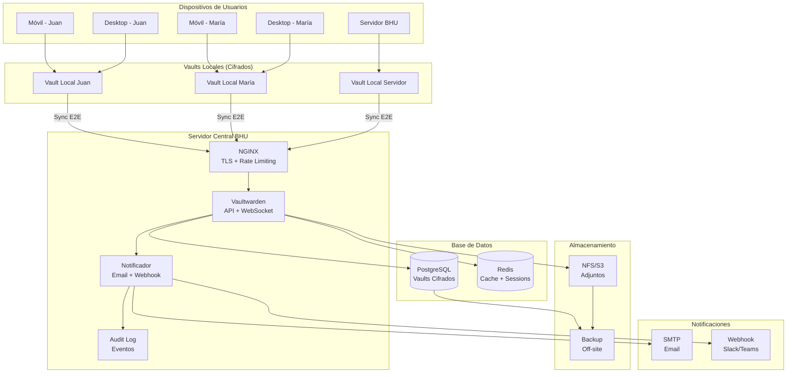

# 6.1 Arquitectura Híbrida: Contraseñas Locales + Servidor Central

## Concepto de Arquitectura Híbrida

La arquitectura híbrida combina **almacenamiento local** de contraseñas con un **servidor central** que ofrece sincronización, notificaciones, auditoría y respaldo.

```
┌─────────────────────────────────────────────────────────────────────────┐
│                    ARQUITECTURA HÍBRIDA - VISIÓN GENERAL                │
├─────────────────────────────────────────────────────────────────────────┤
│                                                                         │
│  CAPA 1: ALMACENAMIENTO LOCAL (Cada Dispositivo)                      │
│  ┌─────────────────────────────────────────────────────────────┐       │
│  │                                                             │       │
│  │  📱 Móvil          💻 Desktop        🖥️ Servidor          │       │
│  │  ┌──────────┐     ┌──────────┐     ┌──────────┐           │       │
│  │  │Vault     │     │Vault     │     │Vault     │           │       │
│  │  │Local     │     │Local     │     │Local     │           │       │
│  │  │Cifrado   │     │Cifrado   │     │Cifrado   │           │       │
│  │  └──────────┘     └──────────┘     └──────────┘           │       │
│  │       │                │                │                   │       │
│  │       └────────────────┼────────────────┘                   │       │
│  │                        │                                    │       │
│  │                    Sync E2E                                 │       │
│  │                    (Cifrado)                                │       │
│  │                        │                                    │       │
│  └────────────────────────┼────────────────────────────────────┘       │
│                           │                                            │
│                           ▼                                            │
│  CAPA 2: SERVIDOR CENTRAL (BHU)                                       │
│  ┌─────────────────────────────────────────────────────────────┐       │
│  │                                                             │       │
│  │  ┌──────────────┐  ┌──────────────┐  ┌──────────────┐     │       │
│  │  │ Vaultwarden  │  │ Notificador  │  │ Audit Log    │     │       │
│  │  │ Server       │  │ de Eventos   │  │ Central      │     │       │
│  │  └──────────────┘  └──────────────┘  └──────────────┘     │       │
│  │                                                             │       │
│  │  Funciones del servidor central:                           │       │
│  │  ✅ Sincronización entre dispositivos                      │       │
│  │  ✅ Notificaciones por email/webhook                       │       │
│  │  ✅ Registro centralizado de actividad                     │       │
│  │  ✅ Compartición entre departamentos                       │       │
│  │  ✅ Backup de vaults de usuarios                           │       │
│  │  ✅ Verificación HIBP                                      │       │
│  │  ✅ Gestión de organizaciones y permisos                   │       │
│  │                                                             │       │
│  │  ❌ El servidor NUNCA ve contraseñas en texto plano        │       │
│  │  ❌ El servidor NUNCA puede descifrar los vaults           │       │
│  │  ❌ Si el servidor cae, los vaults locales siguen accesibles│      │
│  │                                                             │       │
│  └─────────────────────────────────────────────────────────────┘       │
│                                                                         │
│  CAPA 3: RESPALDO Y RECUPERACIÓN                                      │
│  ┌─────────────────────────────────────────────────────────────┐       │
│  │                                                             │       │
│  │  ┌──────────────┐  ┌──────────────┐  ┌──────────────┐     │       │
│  │  │ Backup       │  │ Backup       │  │ Backup       │     │       │
│  │  │ Local (USB)  │  │ Off-site     │  │ Cifrado      │     │       │
│  │  └──────────────┘  └──────────────┘  └──────────────┘     │       │
│  │                                                             │       │
│  │  Regla 3-2-1:                                              │       │
│  │  - 3 copias de los datos                                   │       │
│  │  - 2 medios diferentes                                     │       │
│  │  - 1 copia off-site                                        │       │
│  │                                                             │       │
│  └─────────────────────────────────────────────────────────────┘       │
│                                                                         │
└─────────────────────────────────────────────────────────────────────────┘
```

## Flujo de Datos Detallado

### Flujo Normal: Uso de Contraseña

```
┌──────────┐                    ┌──────────┐                    ┌──────────┐
│  Usuario │                    │  Vault   │                    │ Servidor │
│  (Móvil) │                    │  Local   │                    │  Central │
├──────────┤                    ├──────────┤                    ├──────────┤
│          │                    │          │                    │          │
│ 1. Solicita│                  │          │                    │          │
│ contraseña│                   │          │                    │          │
│──────────►│                   │          │                    │          │
│          │                    │          │                    │          │
│          │ 2. Descifra vault  │          │                    │          │
│          │ local              │          │                    │          │
│          │───────────────────►│          │                    │          │
│          │                    │          │                    │          │
│          │ 3. Retorna         │          │                    │          │
│          │ contraseña         │          │                    │          │
│          │◄───────────────────│          │                    │          │
│          │                    │          │                    │          │
│ 4. Usa   │                    │          │                    │          │
│ contraseña│                   │          │                    │          │
│          │                    │          │                    │          │
│          │ 5. Opcionalmente   │          │                    │          │
│          │ sincroniza         │          │                    │          │
│          │───────────────────►│──────────│ 6. Sync E2E       │          │
│          │                    │          │───────────────────►│          │
│          │                    │          │                    │          │
│          │                    │          │ 7. Registra evento │          │
│          │                    │          │ (sin ver datos)    │          │
│          │                    │          │                    │          │
│          │                    │          │ 8. Envía email:    │          │
│          │                    │          │ "Contraseña usada" │          │
│          │                    │          │───────────────────►│ Email    │
│          │                    │          │                    │          │
└──────────┘                    └──────────┘                    └──────────┘
```

### Flujo de Emergencia: Sin Conexión

```
┌──────────┐                    ┌──────────┐
│  Usuario │                    │  Vault   │
│  (Móvil) │                    │  Local   │
├──────────┤                    ├──────────┤
│          │                    │          │
│ 1. Sin internet               │          │
│          │                    │          │
│ 2. Accede a vault local       │          │
│──────────►│                   │          │
│          │                    │          │
│ 3. Descifra con master pass   │          │
│          │───────────────────►│          │
│          │                    │          │
│ 4. Retorna contraseña         │          │
│          │◄───────────────────│          │
│          │                    │          │
│ 5. Usa contraseña             │          │
│          │                    │          │
│ 6. Cuando haya internet:     │          │
│    - Sincroniza cambios      │          │
│    - Registra evento         │          │
│    - Envía notificación      │          │
│                              │          │
└──────────┘                    └──────────┘
```

## Decisiones de Diseño

### ¿Qué va en el Vault Local vs Servidor Central?

```
┌─────────────────────────────────────────────────────────────────────────┐
│                    DISTRIBUCIÓN DE DATOS                                 │
├─────────────────────────────────────────────────────────────────────────┤
│                                                                         │
│  VAULT LOCAL (Cada dispositivo del usuario):                           │
│  ├── ✅ Contraseñas personales                                        │
│  ├── ✅ Notas seguras personales                                      │
│  ├── ✅ Credenciales de servicios personales                          │
│  ├── ✅ Información de identidad (DNI, cédula)                       │
│  └── ✅ Datos que el usuario no quiere en servidor central            │
│                                                                         │
│  SERVIDOR CENTRAL:                                                     │
│  ├── ✅ Sincronización de vaults entre dispositivos                   │
│  ├── ✅ Registro de eventos (sin datos sensibles)                     │
│  ├── ✅ Notificaciones por email                                      │
│  ├── ✅ Colecciones compartidas entre departamentos                   │
│  ├── ✅ Gestión de usuarios y permisos                                │
│  ├── ✅ Verificación HIBP                                             │
│  ├── ✅ Backup de vaults (cifrados)                                   │
│  └── ✅ Auditoría de actividad                                        │
│                                                                         │
│  NO VA EN NINGUNA PARTE:                                               │
│  ├── ❌ Contraseñas en texto plano                                    │
│  ├── ❌ Claves maestras en el servidor                                │
│  └── ❌ Datos sin cifrar en logs                                       │
│                                                                         │
└─────────────────────────────────────────────────────────────────────────┘
```

### Tabla de Decisión

| Dato | Local | Servidor | Justificación |
|------|-------|----------|---------------|
| Contraseña personal | ✅ | ✅ (cifrado) | Sincronización |
| Contraseña compartida | ✅ | ✅ (cifrado) | Compartición |
| API key personal | ✅ | ❌ | Sensibilidad |
| Nota segura | ✅ | ✅ (cifrado) | Backup |
| Evento de uso | ❌ | ✅ (sin datos) | Auditoría |
| Hash de verificación | ❌ | ✅ | HIBP check |
| Logs de actividad | ❌ | ✅ (sin datos) | Monitoreo |
| Backup del vault | ❌ | ✅ (cifrado) | Recuperación |
| Clave maestra | ❌ | ❌ | Nunca se almacena |
| Datos de auditoría | ❌ | ✅ | Compliance |

## Ventajas de la Arquitectura Híbrida

```
┌─────────────────────────────────────────────────────────────────────────┐
│                    VENTAJAS DE LA ARQUITECTURA HÍBRIDA                   │
├─────────────────────────────────────────────────────────────────────────┤
│                                                                         │
│  ✅ DISPONIBILIDAD                                                     │
│  ├── Contraseñas accesibles sin internet                              │
│  ├── Sin dependencia del servidor para uso diario                     │
│  ├── Vault local siempre disponible                                   │
│  └── Offline-first design                                             │
│                                                                         │
│  ✅ SEGURIDAD                                                          │
│  ├── Cifrado E2E (servidor nunca ve datos)                           │
│  ├── Zero-knowledge model                                             │
│  ├── Si el servidor cae, datos siguen seguros                         │
│  └── Si el servidor es comprometido, datos están cifrados            │
│                                                                         │
│  ✅ SINCRONIZACIÓN                                                     │
│  ├── Sync automática entre dispositivos                               │
│  ├── Compartición entre departamentos                                 │
│  ├── Última versión siempre disponible                                │
│  └── Resolución de conflictos (última escritura gana)                │
│                                                                         │
│  ✅ AUDITORÍA Y MONITOREO                                              │
│  ├── Registro centralizado de actividad                               │
│  ├── Notificaciones por email                                         │
│  ├── Verificación automática de brechas (HIBP)                        │
│  └── Cumplimiento normativo (GDPR, PCI-DSS)                          │
│                                                                         │
│  ✅ RECUPERACIÓN                                                       │
│  ├── Backup automático de vaults                                      │
│  ├── Múltiples ubicaciones de respaldo                                │
│  ├── Procedimiento documentado de recuperación                        │
│  └── Sin punto único de fallo                                         │
│                                                                         │
│  ✅ COSTO                                                              │
│  ├── $0 en licencias                                                  │
│  ├── Infraestructura existente                                        │
│  ├── Sin costo por usuario                                            │
│  └── ROI inmediato                                                    │
│                                                                         │
└─────────────────────────────────────────────────────────────────────────┘
```

## Diagrama de Arquitectura Completa (Mermaid)



## Configuración de Sync

### Vaultwarden: Configuración de Sincronización

```yaml
# docker-compose.yml - Configuración de sync
services:
  vaultwarden:
    environment:
      # Sync automático
      WEBSOCKET_ENABLED: "true"
      WEBSOCKET_URL: wss://vaultwarden.bhu.uy/hub
      
      # Intervalo de sync (default: 30 seg)
      # Se puede configurar en el cliente
      
      # Límites
      MAX_LOGIN_ATTEMPTS: 5
      LOGIN_TIME_LIMIT: 3600  # 1 hora
      USER_INVITATION_LIMIT: 5
```

### Cliente: Configuración de Sync

```
EN EL CLIENTE (Extensión Navegador / App):

Settings → Sync:
├── Sync interval: 30 seconds (default)
├── Sync on startup: Yes
├── Sync on unlock: Yes
├── Background sync: Yes
└── Offline mode: Yes (cache local)

Settings → Security:
├── Lock on minimize: Yes
├── Lock on close: Yes
├── Lock timeout: 15 minutes
├── Unlock with PIN: Yes (configurar)
└── Unlock with biometrics: Yes
```

---

> **Actividad**: Diseña un diagrama de arquitectura híbrida para una empresa de 50 personas con 3 sedes. Define qué va en vaults locales vs servidor central, y cómo se maneja la sincronización entre sedes.
